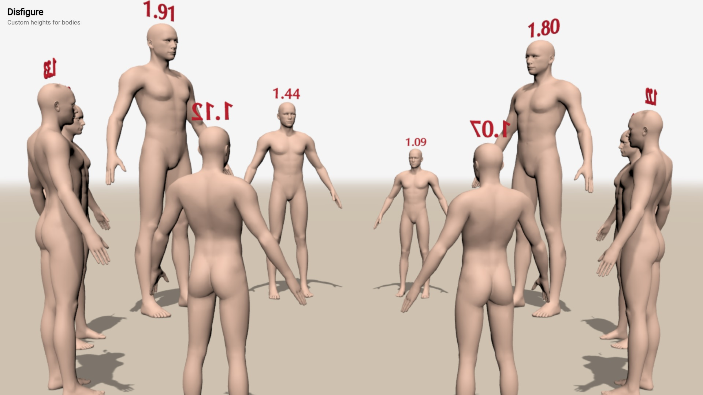
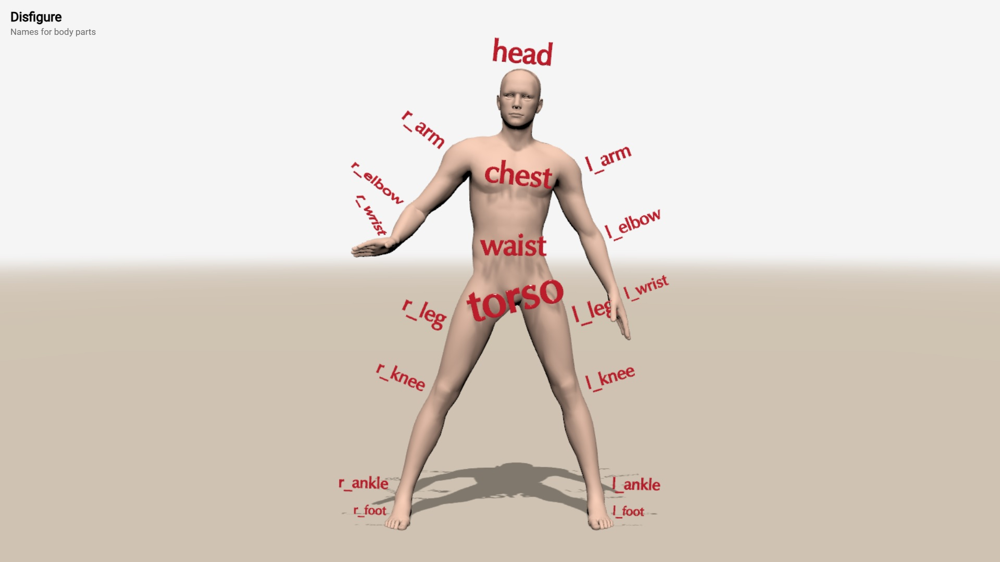
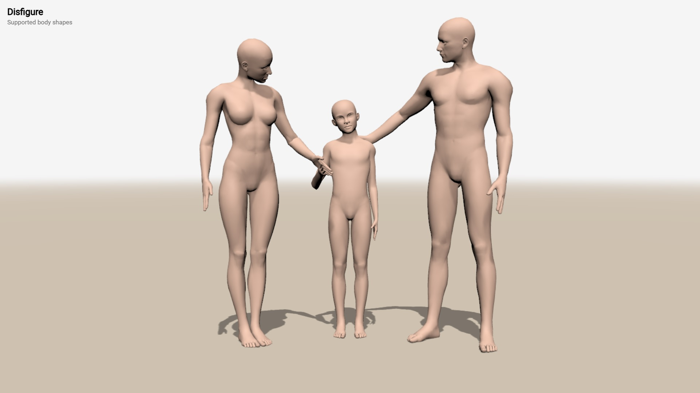
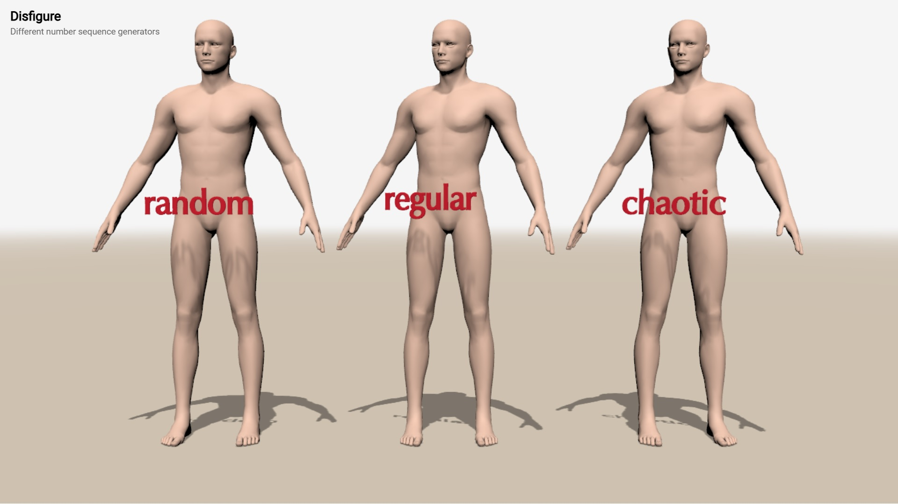

# disfigure

A library to rig non-rigged 3D models. **WIP.**

* [Disfigure home](https://boytchev.github.io/disfigure/index.html)
* [User guide](https://boytchev.github.io/disfigure/docs/userguide.html)
* [Posture editor](https://boytchev.github.io/disfigure/poser)

## Demos

Videos of work-in-progress states of the TSL rigging. Click on a snapshot to go to an X post with a video and a link to live demo.

  

## Proof of concept

Videos of earlier attempts for TSL rigging.

  

  

## Examples

