# Figure customizations

Apart for moving body parts, Disfigure provides basic functionality
for additional modification of a figure &ndash; adding accessories
or changing colors.


## Accessories

### figure.bodypart.**attach**( *accessory*, *x*, *y*, *z* )<br>figure.bodypart.**attach**( *accessory* )

Accessories are Three.js objects attached to a specific body part.
They do not deform, but move as if attached to the body. The position
of *accessory* is defined by the optional parameters *x*, *y* and *z*.
The position is in respect to the origin point of the body part &ndash;
[see it](../examples/extras-attach.html). Alternatively, the position
of an accessory could be set via its Three.js `position` property.

``` javascript
figure.l_arm.attach(spike);
```

### figure.bodypart.**point**( *x*, *y*, *z* )

When just the final coordinates are needed it is faster to use `point`,
which calculates the position and ignores the orientation &ndash;
[see it](../examples/extras-point.html).

``` javascript
v = figure.l_arm.point(0,0.1,0);
```

[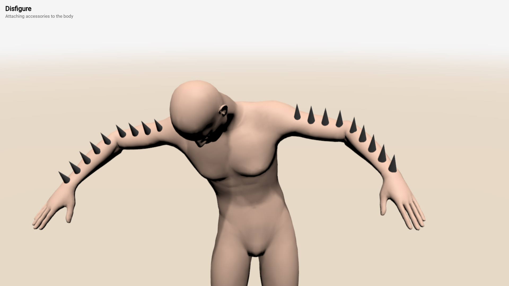](../examples/extras-attach.html)
[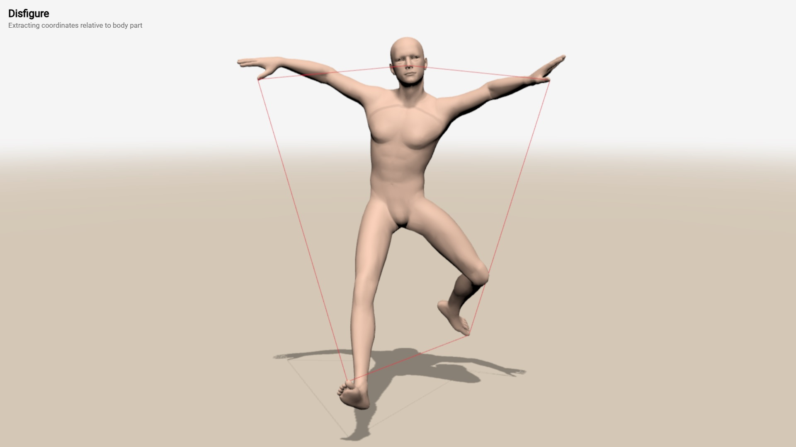](../examples/extras-point.html)


### figure.bodypart.**lockTo**( *localX*, *localY*, *localZ*, *globalX*, *globalY*, *globalZ* )

The function `lockTo` moves the whole figure so that the local point
(*localX*, *localY*, *localZ*) of *bodypart* is mapped to the global
point (*globalX*, *globalY*, *globalZ*). This can be used to keep a
figure standing on the ground (by locking its feet to level 0). The
following examples shows two floating figures touching the same spot
with their fingers &ndash; [see it](../examples/extras-lockto.html).

``` javascript
figure.l_wrist.lockTo(0.2,-0.01,0.01, 0, 1.5, 0 );
```

[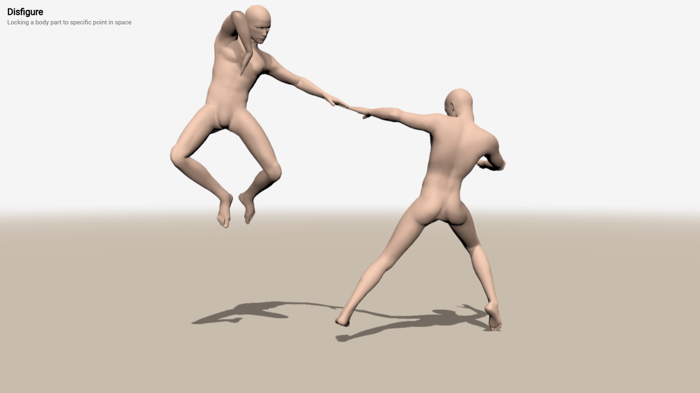](../examples/extras-lockto.html)


## Custom colors

Disfigure supports a painting interface to draw simple shapes
directly onto the skin of a figure.

### figure.**dress**( *clothing* )

This function defines the dressing of a figure. The description
of the *clothing* is an array of range and material functions.
The range function selects a portion of the body skin, called *slice*,
and the material function applies a material to it. The structure of
the clothing is:

```javascript
[
   material,            // default material
   
   slice_1, material_1, // optional materials
   slice_2, material_2,
   ...
   slice_N, material_N
]
```

The *material* is the mandatory default material for the whole
figure. The next optional slice-material pairs define slices
and materials for each slice &ndash; [see it](../examples/extras-clothes-uniform.html).

``` javascript
figure.dress([

   Happy.velour( 'black' ),

   Happy.slice( 1.1, 2, {angle: -20} ),
   Happy.velour( 'red' ),

   Happy.slice( 1.15, 2, {angle: 35} ),
   Happy.velour( 'red' ),
   ...
];
```
[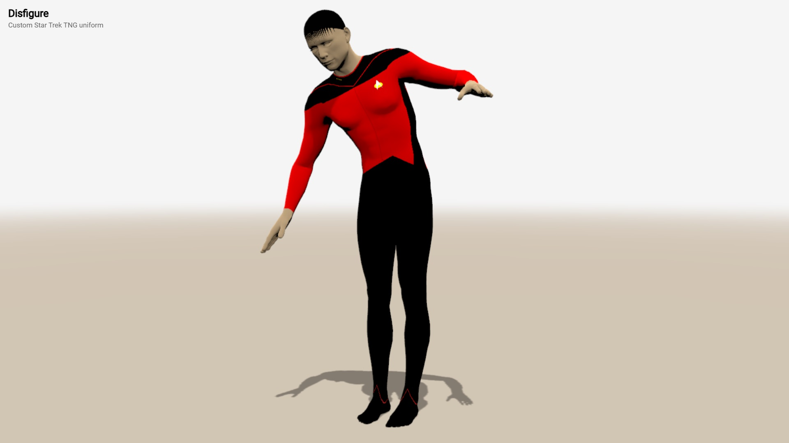](../examples/extras-clothes-uniform.html)


### **velour**( *color* )<br>**latex**( *color* )

The functions *velour* and *latex* define matte material &ndash;
[see it](../examples/extras-clothes-velour.html) and shiny
material &ndash; [see it](../examples/extras-clothes-latex.html)
The *color* is either a [Three.js color](https://threejs.org/docs/#api/en/math/Color)
or a [HTML/CSS color name](https://www.w3schools.com/colors/colors_names.asp).

``` javascript
velour( 'green' )
latex( 'red' )
```
[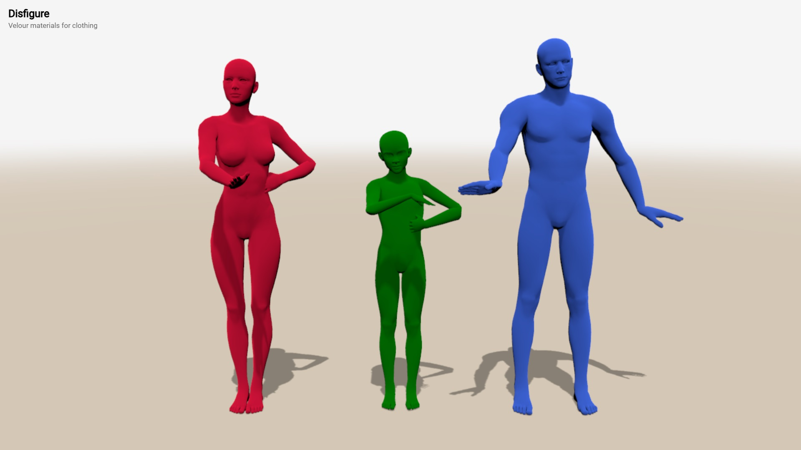](../examples/extras-clothes-velour.html)
[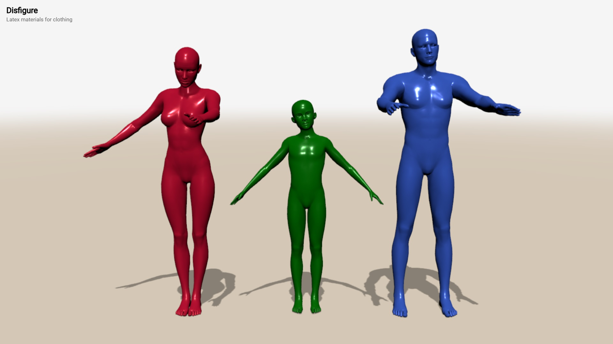](../examples/extras-clothes-latex.html)

### **bands**( *material_1*, *material_2*, *width*, *options* )

The *bands* function makes a composite material of alternating horizontal
bands of *material_1* and *material_2*. The *width* of each band
is defined in meters.  The optional *options* parameter provides additional properties
for the band &ndash; [see it](../examples/extras-clothes-bands.html).
Adequate blurring the bands may improve the visual appearance of the bands,
especially when they are too close or too far.

Polar bands revolve around a vertical axis. They are more suitable for
vertical bands that go around a body part &ndash; [see it](../examples/extras-clothes-bands-polar.html).

* **balance** &ndash; the relative weight of the two materials from -1 to 1; 0 means they are equally balanced
* **blur** &ndash; the blurrness of the bands' edges from 0 to 1; 0 is no blur, 1 is maximal blur
* **angle** &ndash; the rotation of bands in degrees, from -360 to 360; 0 is horizontal bands, 90 is vertical bands
* **polar** &ndash; bands are around a central vertical axis, *angle* is not used and *width* represents portions of a full circle of one band, i.e. 1/10 is 10 bands
* **x** &ndash; the x-coordinate of a central vertical axis, used only for polar bands
* **z** &ndash; the z-coordinate of a central vertical axis, used only for polar bands

```javascript
Happy.bands(
   Happy.latex( 'crimson' ),
   Happy.velour( 'azure' ),
   0.015, { balance: 0.9, blur: 0.2, angle: 90 }
)
```

[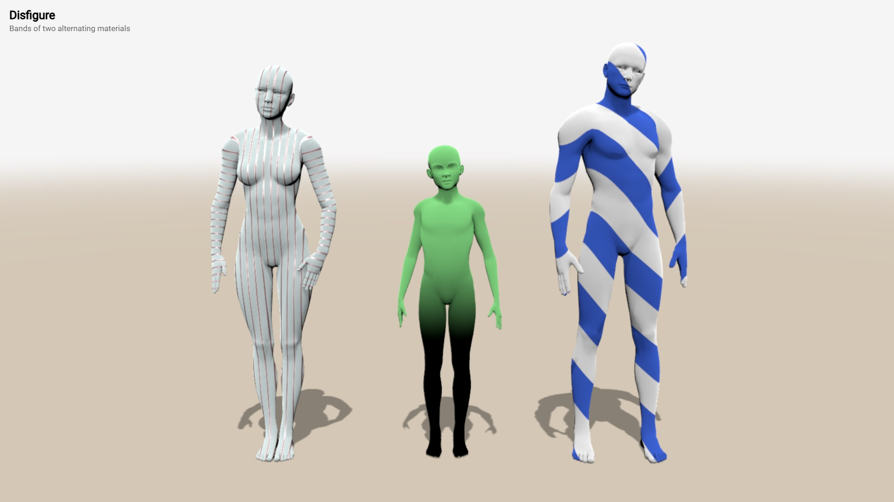](../examples/extras-clothes-bands.html)
[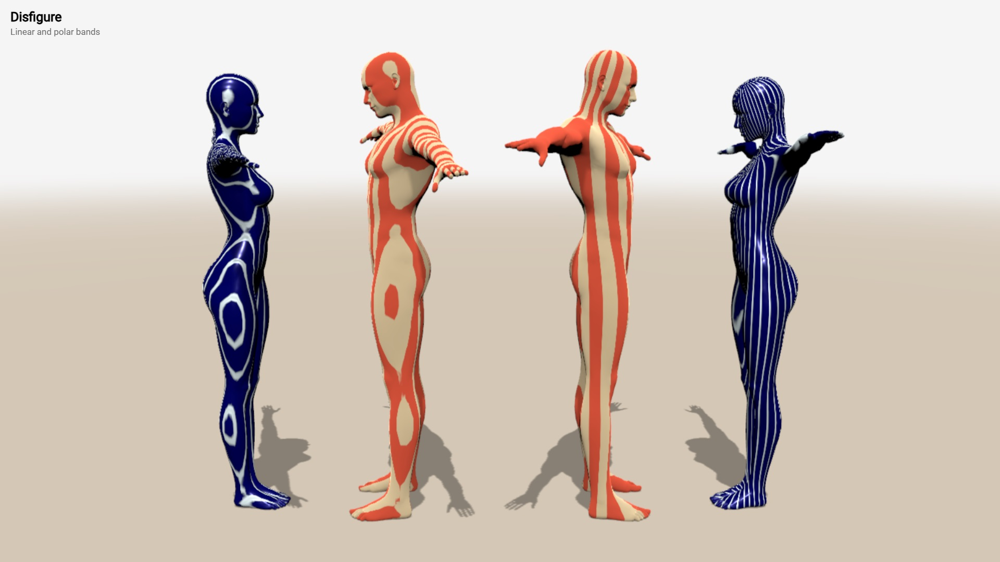](../examples/extras-clothes-bands-polar.html)

### **slice**( *from*, *to*, *options* )

The *slice* function defines a slice of a figure &ndash; this is a part
of the figure that is dressed in given material. Parameters *from* and *to*
define the start and the end of the slice, measure in meters. By default,
a slice is horizontal, thus *from* and *to* denote distance from the ground.
The optional *options* parameter provides additional properties
for the slice like their orientation &ndash; [see it](../examples/extras-clothes-slice.html),
their rotation &ndash; [see it](../examples/extras-clothes-slice-angle.html).

* **side** &ndash; if true, the slice is vertical across the front-back of a figure
* **front** &ndash; if true, the slice is vertical across the left-right of a figure 
* **angle** &ndash; the rotation of the slice in degrees around one axis, from -360 to 360
* **sideAngle** &ndash; the rotation of the slice in degrees around another axis, from -360 to 360
* **symmetry** &ndash; if true, the slice is symmetrical, i.e. [-to,-from] and [from,to]

```javascript
Happy.slice( -0.07, 0.03, {front: true} )
Happy.slice( 0.70, 1.40, {angle:55} )
```

[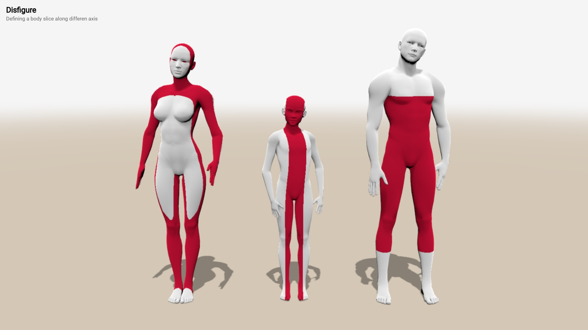](../examples/extras-clothes-slice.html)
[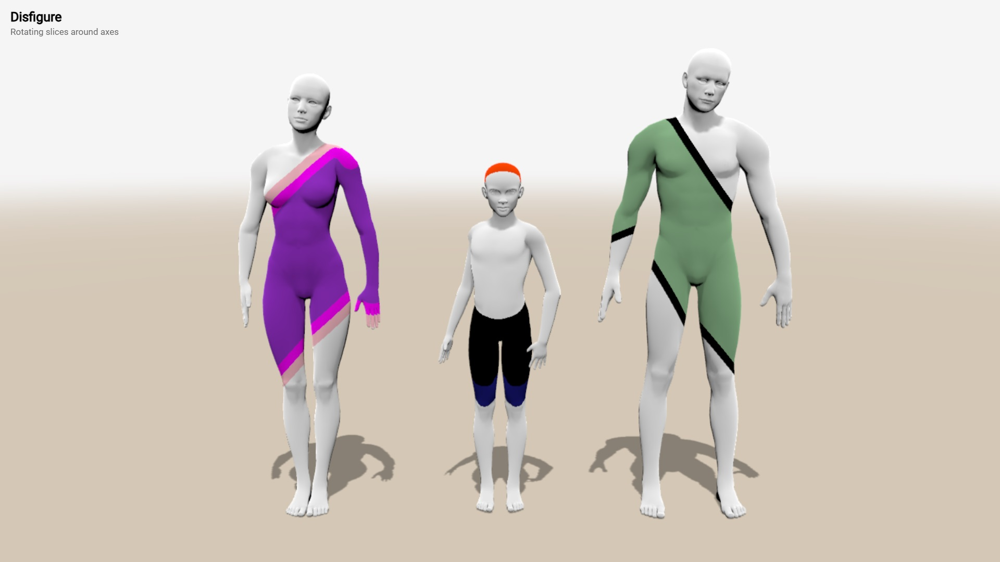](../examples/extras-clothes-slice-angle.html)


Additionally, slices could be curved as a wave when a non-zero
*wave* option is provided &ndash; [see it](../examples/extras-clothes-slice-wave.html)

* **wave** &ndash; height of the weight in meters
* **width** &ndash; width of a single wave in meters, this defines how sparse or dense is the wave
* **sharpness** &ndash; defines how sharp are the edges of the wave, 0 is for sharp, 1 is for sinusoidal, intermediate values, as well as less than 0 or greater than 1 are also accepted

```javascript
Happy.slice( 1.3, 2, {wave:0.15, width:0.1, sharpness:1} )
```
			
[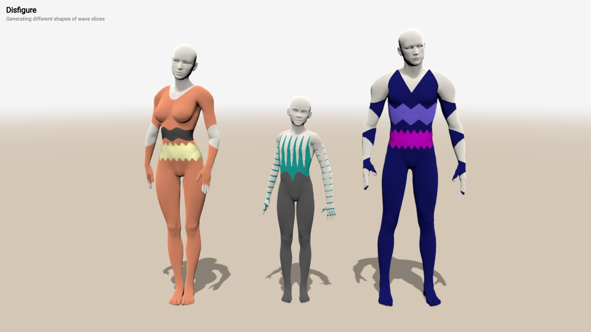](../examples/extras-clothes-slice-wave.html)

### slice(...).**and**( *slice* )<br>slice(...).**or**( *slice* )

Slices can be combined into more complex shapes by intersecting or uniting them.
The function `and` intersects two slices, e.g. *slice_1.and(slice_2)* generates
a slice containing all points both in *slide_1* **and** in *slide_2*, while `or`
unites two slices, e.g. *slice_1.or(slice_2)* generates a slice containing all
points either in *slide_1* **or** in *slide_2*  &ndash;
[see it](../examples/extras-clothes-slice-and-or.html)

```javascript
Happy.slice( -0.1, 1.1, {angle:45, wave: 0.3, width:0.02} )
   .and( Happy.slice( -0.3, 0.9, {angle:-45, wave: 0.3, width:0.02} ) )
   .or( Happy.slice( -0.2, 0.2 ) ),

```

[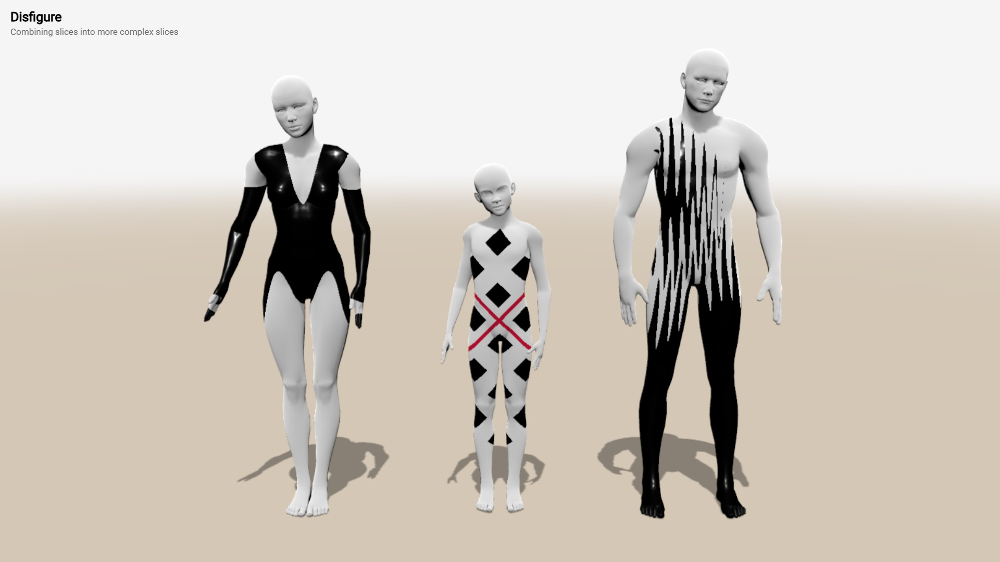](../examples/extras-clothes-slice-and-or.html)


## TSL textures

Disfigure is compatible with most [TSL Textures](https://boytchev.github.io/tsl-textures/)
&ndash; real-time textures generated via TSL. However, textures are currently
not compatible with figure dressing. To use a TSL Texture it must be imported.
As textures use Three.js color objects, Three.js should also be imported.

Each texture is activated with a function, assigned to the figure's
`material.colorNode` property &ndash;
[see it](../examples/extras-tsl-texture-simple.html). Different figures may
have individual TSL textures &ndash;
[see it](../examples/extras-tsl-texture.html).

```javascript
import * as Three from "three";
import * as TSLTexture from "https://cdn.jsdelivr.net/npm/tsl-textures@2.1.2/dist/tsl-textures.min.js";
:
figure.material.colorNode = TSLTexture.camouflage ( {
	scale: 3,
	colorA: new Three.Color(12762792),
	colorB: new Three.Color(10258782),
	colorC: new Three.Color(9610101),
	colorD: new Three.Color(7435617),
} );
```

[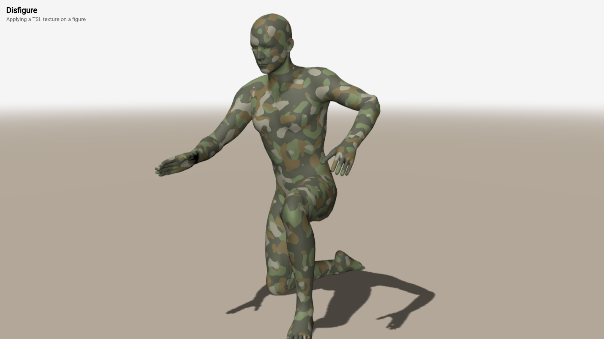](../examples/extras-tsl-texture-simple.html)
[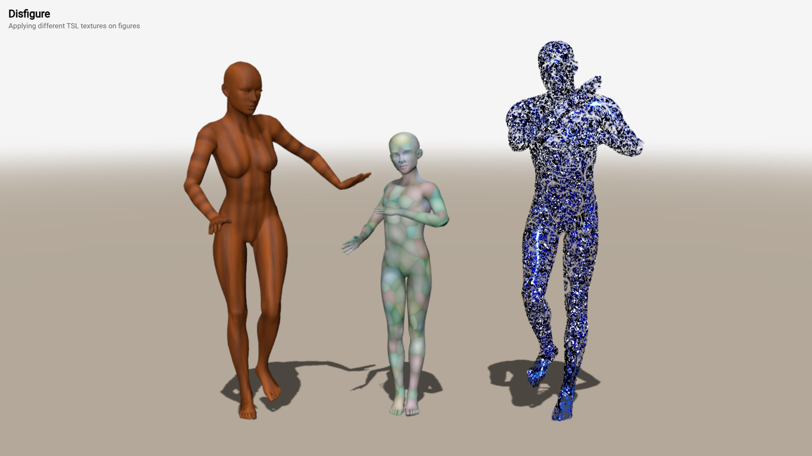](../examples/extras-tsl-texture.html)
		
# Using mannequin.js

The **mannequin.js** library is provided as a set of JavaScript modules. It is
intended to be used from a CDN. Most likely the library can be installed via
`npm`, however this is not tested so far.

The library uses Three.js and expects the following import maps to be defined:

* `three`: pointer to the Three.js built called `three.module.js` 
* `three/addons/`: pointer to the path of Three.js addons
* `mannequin`: pointer to the main library file called `mannequin.js`

The following subsections demonstrate some possible configuration scenarios of
using mannequin.js.


### Running from a CDN

CDN stands for [Content Delivery Network](https://en.wikipedia.org/wiki/Content_delivery_network). 
Within mannnequin.js a CDN serves as a host of the library files. At the time of
writing this document it is recommended to use [jsDelivr](https://cdn.jsdelivr.net)
as CDN. Other CDNs are also available.

The main advantages of using a CDN are:
* there is no need to install mannequin.js
* there is no need to install nodes.js or another JS module manager
* there is no need to install a local web server
* a user file can be directly run in a browser

The main disadvantages of using a CDN are:
* internet access to the CDN is reuqired at program startup
* pointers to Three.js and mannequin.js must be defined as importmaps

A somewhat minimal program that uses mannequin.js from this CDN is shown
in this [see it](example-minimal-cdn.html). If the file is downloaded, it
could be run locally without any additional installation. The importmaps in the
example point to specific release of Three.js and to the latest version of mannequin.js.

```html
<!DOCTYPE html>

<html>

<head>
   <script type="importmap">
   {
      "imports": {
         "three": "https://cdn.jsdelivr.net/npm/three@0.170.0/build/three.module.js",
         "three/addons/": "https://cdn.jsdelivr.net/npm/three@0.170.0/examples/jsm/",
         "mannequin": "https://cdn.jsdelivr.net/npm/mannequin-js@latest/src/mannequin.js"
      }
   }
   </script>
</head>

<body>
   <script type="module">
      import { createStage, Male } from "mannequin";
      createStage( );
      new Male();
   </script>
</body>
</html>
```

Note that many of the examples in this document use the script `importmap.js`
to generate the import maps and inject them in the page. This is done solely
for maintaining shorter code and to easily switch to other versions of either
Three.js or mannequin.js.


### Running via a local web server

It is the same as running from a CDN, a local folder serves as a CDN. The only
change is the paths of the import maps should point to local paths. 

The main advantages of using only local files are:

* no internet access is required
* no need to install nodes.js or another JS module manager
* protection from a breaking change in the online libraries
* a user file can be directly run in a browser
* user code can use modules and can be split in several files

The main disadvantages of using only local files are:

* mannequin.js and all its source files must be downloaded
* a local web server must be installed
* pointers to local Three.js and mannequin.js must be still defined as importmaps

It is possible to CDN and local usage. For example, using online Three.js and 
local mannequin.js. This is defined in the paths of the import maps.


### Running via nodes.js

The library is provided as a NPM package. If nodes.js is installed on the user
machine, it should be possible to install mannequin.js and use it directly.

The main advantages of using nodes.js:

* no internet access is required once the package istallation is done
* no need to use import maps (the whole importmaps section can be omitted)
* protection from a breaking change in the online libraries

The main disadvantages of using using nodes.js:
* nodes.js must be installed
* mannequin.js must be installed

Note: This approach is not tested. If you find that it is not working and you
know how to fix it, please get in touch.
