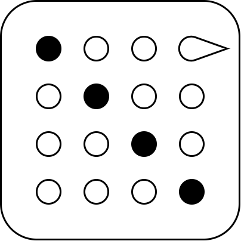


# Disfigure: User Guide


## <small><small>[Figures](#figure-shapes) &middot; [Motions](#figure-motions) &middot; [World](#predefined-world) &middot; [Others](#others)</small></small>


<!--## <small><small>Този документ е наличен и на [български език](userguide-bg.md)</small></small>-->

Disfigure is a library for animating human figures by modifying
a matrix field of the space around them. Here is an absurdly
minimal demo &ndash; [see it live](../examples/minimal.html).

```js
import * as Happy from 'disfigure'
	
new Happy.World
new Happy.Man
```

# Figure shapes

### new **Man**( *height* )<br>new **Woman**( *height* )<br>new **Child**( *height* )

Disfigure defines figures as instances of classes `Man`, `Woman`
and `Child` &ndash; [see it](../examples/figure-create-basic.html).
The optional parameter *height* defines the height of a figure
in meters &ndash; [see it](../examples/figure-create-height.html).
By default a man is 1.80m, a woman is 1.70m and a child is 1.35m.

```js
var man = new Happy.Man( 1.90 );
var woman = new Happy.Woman( );
```

[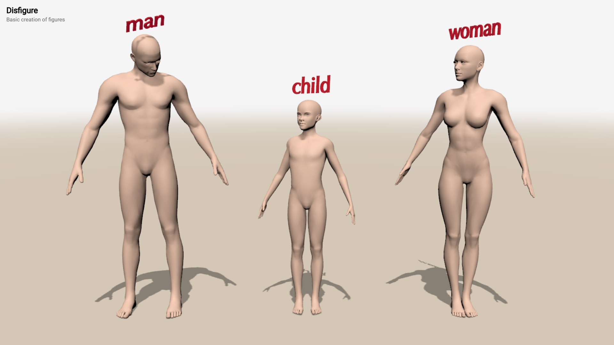](../examples/figure-create-basic.html)
[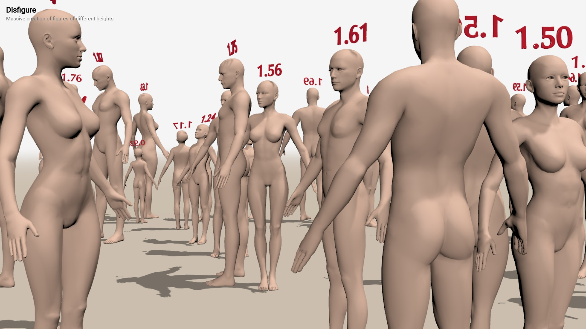](../examples/figure-create-height.html)

All types of figures have the exact same structure with names
corresponding to body parts, like `head` and `chest`. Left and
right body parts are always in respect to the figure. Their
names have prefixes `l_···` for left and `r_···` for right, so
there is `l_knee` and `r_knee` &ndash; [see it](../examples/figure-parts.html):

* **Whole body** &ndash; `torso`
* **Central parts** &ndash; `head`, `chest`, `waist`
* **Upper limbs** &ndash; `arm`, `elbow`, `forearm`, `wrist`
* **Lower limbs** &ndash; `leg`, `thigh`, `knee`, `shin`, `ankle`, `foot`

[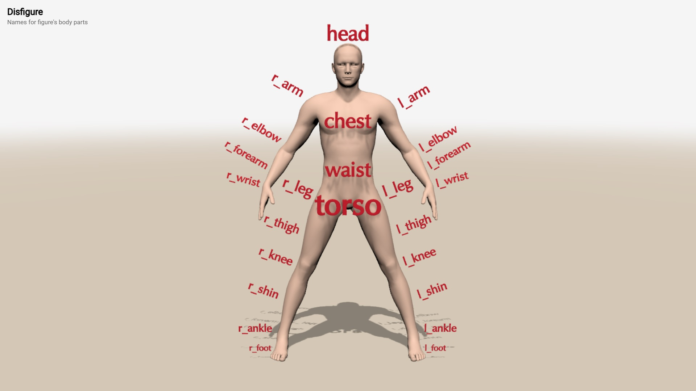](../examples/figure-parts.html)


# Figure motions

## Central parts

The motion of a figure is done by manipulating properties of
body parts. Motions are just rotations measured in degrees.

### figure.**torso**<br>figure.**head**<br>figure.chest<br>figure.**waist**

The `torso` is the root body part and its rotation affects
the whole body. Torso has properties `bend`, `turn` and `tilt`
&ndash; [see it](../examples/motion-torso.html). The central
body parts are `head`, `chest` and `waist`. They have the
same set of properties as the torso &ndash; [see it](../examples/motion-central.html).

* `bend` &ndash; bends foreward or backward
* `turn` &ndash; turns to the left or right
* `tilt` &ndash; tilts sideways to the left or right

```js
figure.torso.bend = 40;
figure.head.bend = 40;
figure.chest.turn = -20;
figure.waist.tilt = 35;
```

[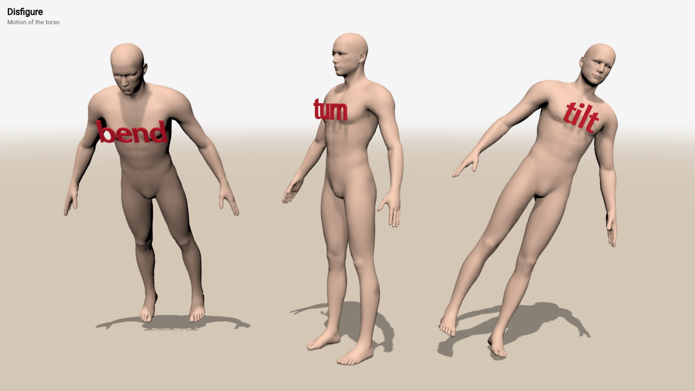](../examples/motion-torso.html)
[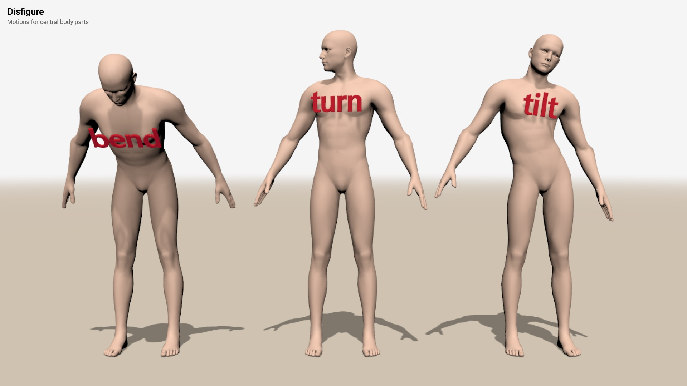](../examples/motion-central.html)


## Upper limbs


### figure.**l_arm**<br>figure.**r_arm**

The upper limbs are symmetrical body parts with multiple joints
and rotation properties that recreate a complex and flexible
motion &ndash; [see it](../examples/motion-limbs-upper.html).
Arms have `foreward`, `turn` and `straddle` &ndash; [see it](../examples/motion-arm.html).

* `foreward` &ndash; moves an arm foreward (or backward)
* `turn` &ndash; turns an arm inwards (or outwards)
* `straddle` &ndash; moves an arm sideways to the body (or away from the body)

``` javascript
figure.r_arm.foreward = 70;
figure.r_arm.straddle = -30;
figure.r_arm.turn = 5;
```

[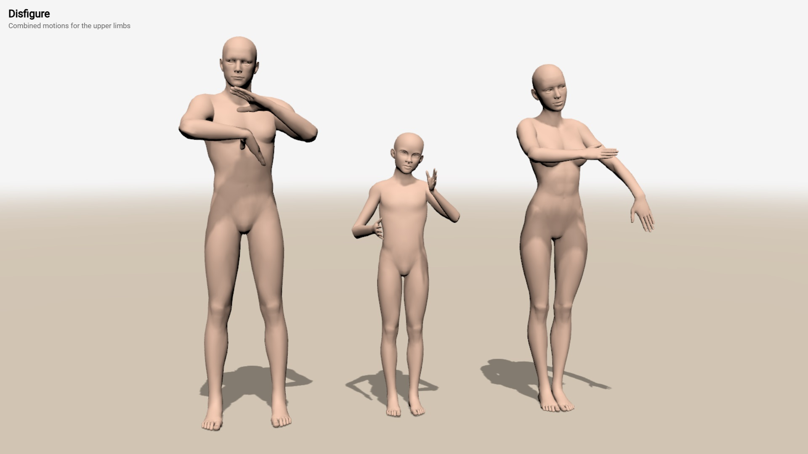](../examples/motion-limbs-upper.html)
[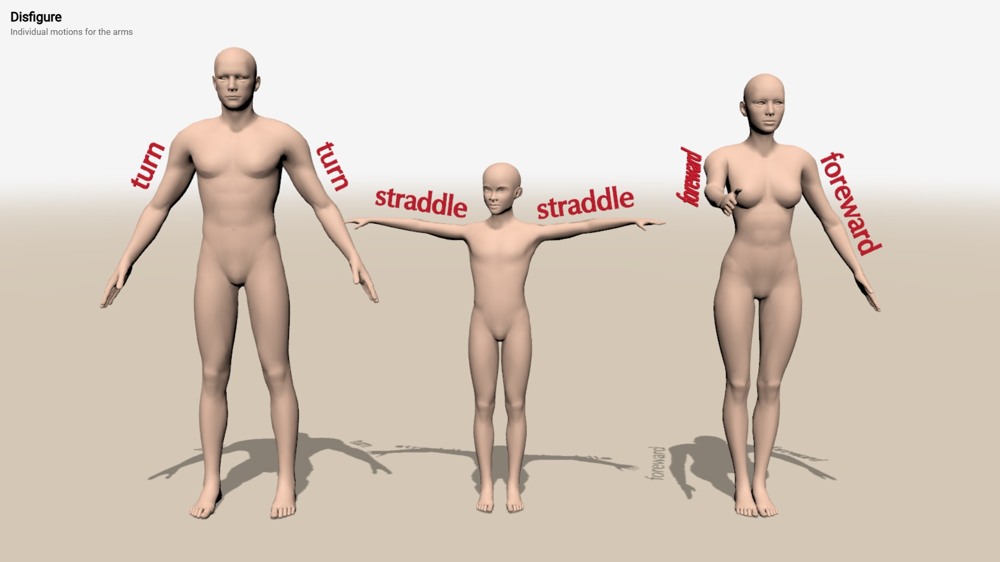](../examples/motion-arm.html)


### figure.**l_elbow**<br>figure.**r_elbow**

Elbows `l_elbow` and `r_elbow` have limited motions. Elbows
have only `bend` &ndash; [see it](../examples/motion-elbow.html).

* `bend` &ndash; bends an elbow towards the body (or away from the body)

``` javascript
figure.r_elbow.bend = 45;
```

[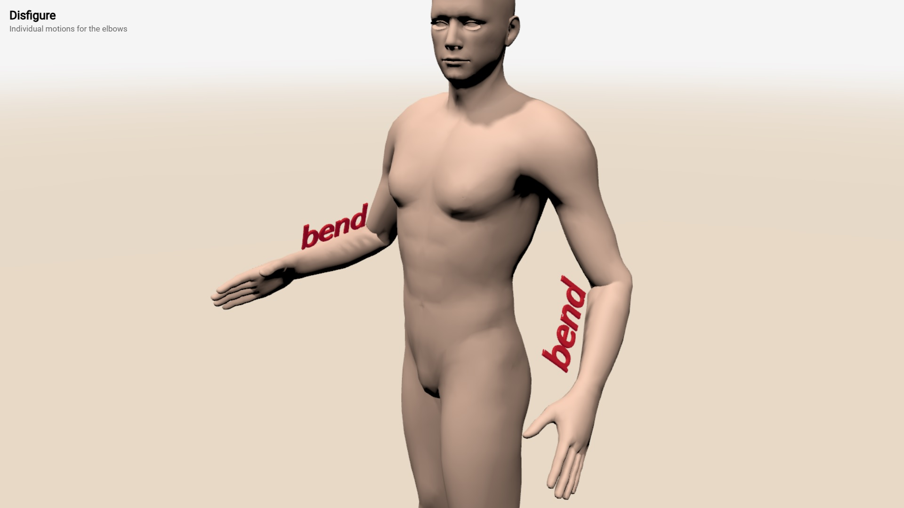](../examples/motion-elbow.html)


### figure.**l_forearm**<br>figure.**r_forearm**

Forearms `l_forearm` and `r_forearm` have limited motions.
Forearms have only `turn` &ndash; [see it](../examples/motion-forearm.html).

* `turn` &ndash; turns a forearm inwards (or outwards)

``` javascript
figure.r_forearm.turn = -20;
```

[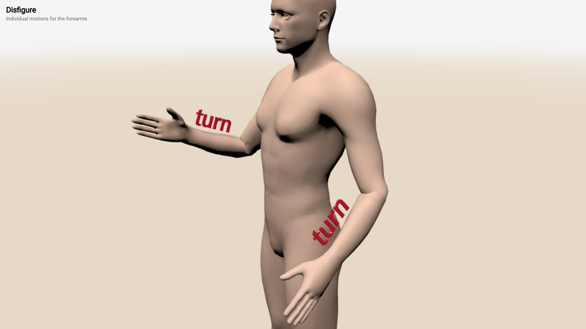](../examples/motion-forearm.html)


### figure.**l_wrist**<br>figure.**r_wrist**

Wrists `l_wrist` and `r_wrist` support `bend` and `tilt` &ndash;
[see it](../examples/motion-wrist.html). Wrist have no turns,
as turning is done in the forearm or the arm.

Motions of `l_wrist` and `r_wrist`:

* `bend` &ndash; bends a wrist down or up
* `turn` &ndash; turns a wrist foreward or backward

``` javascript
man.r_wrist.bend = -60;
man.r_wrist.tilt = 10;
```

[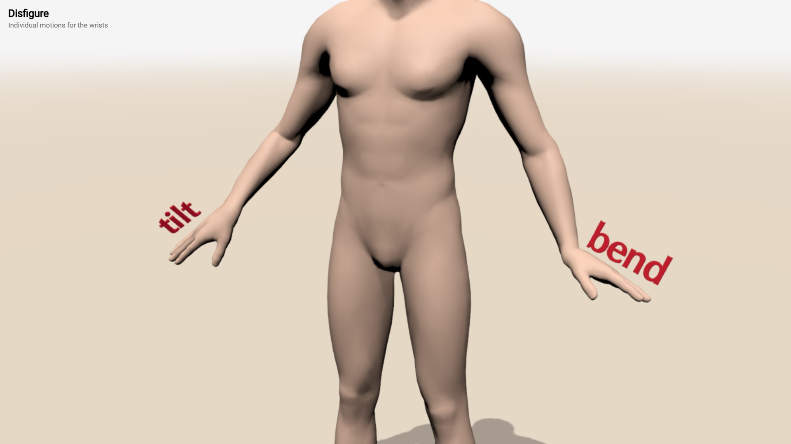](../examples/motion-wrist.html)


## Lower limbs

### figure.**l_leg**<br>figure.**r_leg**

The lower limbs are symmetrical body parts with multiple joints
and rotation properties that recreate a complex and flexible
motion &ndash; [see it](../examples/motion-limbs-lower.html).
Legs have `foreward` and `straddle` &ndash; [see it](../examples/motion-leg.html).

* `foreward` &ndash; moves a leg foreward (or backward)
* `straddle` &ndash; moves a leg sideways away from the body (or to the body)

``` javascript
figure.r_leg.foreward = -10;
figure.r_leg.straddle = 50;
```

[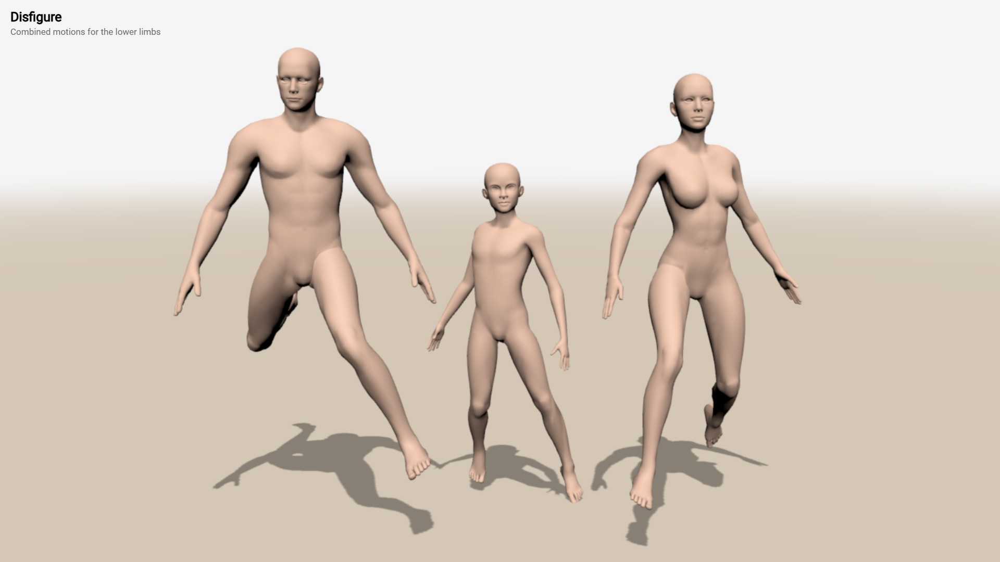](../examples/motion-limbs-lower.html)
[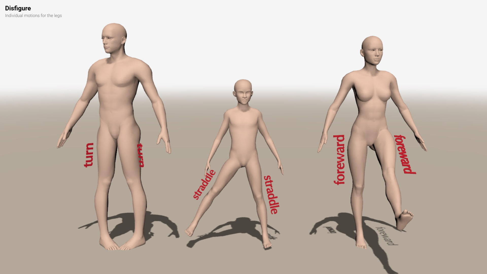](../examples/motion-leg.html)


### figure.**l_thigh**<br>figure.**r_thigh**

Thighs `l_thigh` and `r_thigh` have limited motions.
Thighs have only `turn` &ndash; [see it](../examples/motion-thigh.html).

* `turn` &ndash; turns a thigh outwards (or inwards)

``` javascript
figure.r_thigh.turn = 20;
```

[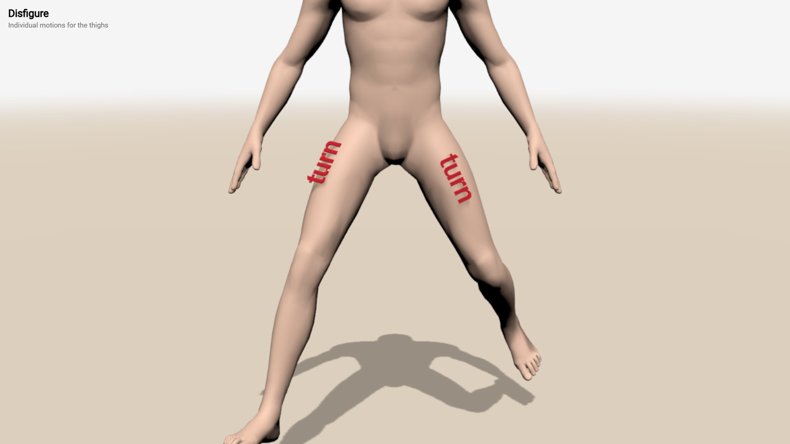](../examples/motion-thigh.html)


### figure.**l_knee**<br>figure.**r_knee**

Knees `l_knee` and `r_knee` support `bend` and `tilt` &ndash;
[see it](../examples/motion-knee.html). Knee have no turns,
as turning is done in the thigh or the shin. However, their
tilting is used to model bowlegs and knock knees.

Motions of `l_knee` and `r_knee`:

* `bend` &ndash; bends a knee backward
* `tilt` &ndash; tilts a knee sideways

``` javascript
man.r_knee.bend = 40;
man.r_knee.tilt = 0;
```

[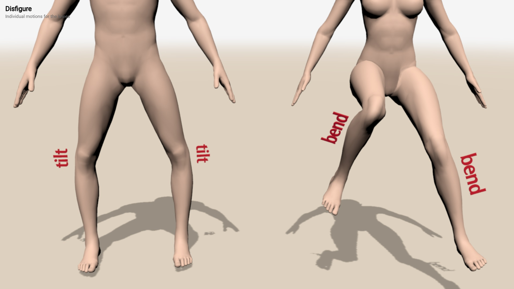](../examples/motion-knee.html)


<!--

The motion of the **knee** is only `bend` ([see it](example-knee.html)). Negative values for *angle* result in unnatural knee position.

``` javascript
figure.r_knee.bend = angle;
```

The **ankles** have the same properties as the wrists: `bend`, `turn` and `tilt` ([see it](example-ankle.html)):

``` javascript
figure.r_ankle.bend = angle;
figure.r_ankle.turn = angle;
figure.r_ankle.tilt = angle;
```


# Body posture

The posture of a figure is defined by a setting the rotation properties of body parts. The order of rotations is important, i.e. changing the order of rotations produce different result. The next example applies bending 45&deg;, turning 90&deg; and tilting 60&deg; of three figures. As the order of rotations is different for each figure, the final position is also different ([see it](example-order.html)):

``` javascript
man.torso.bend += 45;
man.torso.turn += 90;
man.torso.tilt += 60;

child.torso.tilt += 60;
child.torso.bend += 45;
child.torso.turn += 90;

woman.torso.turn += 90;
woman.torso.bend += 45;
woman.torso.tilt += 60;
```

### Static posture

The static posture defines the position of body part that do not change. By default, when a figure is created, its body parts are set to the default posture. If the posture editor is not used, all rotations has to be defined programmatically ([see it](example-posture.html)):

[](example-posture.html)

Sometimes it is better to define the figure step by step. Tai Chi Chuan posture, shown above, could start by defining the whole body position:

``` javascript
// overall body position
man.body.tilt = -5;
man.body.bend = 15.2;
:
// torso and head
man.torso.turn -= 30;
man.head.turn -= 70;
```

Then the orientation of the legs can be set:

``` javascript
// right leg
man.r_leg.turn = 50;
man.r_knee.bend = 90;
man.r_ankle.bend = 15;
:
// left leg
man.l_leg.raise = -20;
man.l_knee.bend = 30;
man.l_ankle.bend = 42;
:
```

Finally, the arms are fixed:
	
``` javascript
// left arm
man.l_arm.straddle = 70;
man.l_elbow.bend = 155;
man.l_wrist.bend = -20;
:
// right arm
man.r_arm.straddle += 70;
man.r_elbow.bend += 40;
man.r_wrist.turn -= 60;
:
```
	
### Dynamic posture

The dynamic posture &ndash; i.e. a posture that changes over time &ndash; is set
with the same properties that are used for static posture. Mannequin.js manages
dynamic posture by a user-defined function called in the animation loop once for
each frame. All changes of a posture should be defined inside this function
([see it](example-dynamic.html)). The parameter *t* is the time, measured
in seconds since the start of the library. The name of the user-defined function
is passed as an argument to `createStage()`.

[](example-dynamic.html)

``` javascript
createStage( animate );

function animate(t)
{
    var time1 = Math.sin( 2*t ),
		time2 = Math.sin( 2*t-60 );
	
    ball.position.x = 0.06*time1;
	
    child.position.y = 0.31 + 0.05*Math.cos(time1 * Math.PI/2);

    child.turn = -90-20*time1+20*time2;
    child.tilt = 10*time1;
    :
}
```

To make the animation loop faster, all constant rotations should be defined outside `animate`. 
			
			
### Working with postures

A posture could be extracted from a figure with the `posture` property. It contains an object with fields `version` for the posture data format version, and `data` &ndash; a nested array for joint angles. The `posture` property can be used to push a posture to a figure. 

``` javascript
{ "version": 7,
  "data": [ [0,0,0], [90,-85,74.8], [16.1,-29.5,26.3], [3.5,-34.8,6.1], ... ]
}
```

There is alternative `postureString` property to get or set the posture as a string. Converting the posture to and from a string is done with `JSON.stringify` and `JSON.parse`.


Postures could be blended via Euler interpolation (i.e. linear interpolation of
Euler anglеs). The function `blend(posture0,posture1,k)` mixes the initial
*posture0* and the final *posture1* with a coefficient *k*&isin;[0,1]. When
*k*=0 the result is *posture0*, when *k*=1 the result is *posture1*, when *k*
is between 0 and 1 the result is a posture between *posture0* and *posture1*.
The following example blends the posture of [one figure](example-posture.html)
and copies it to [another figure](example-posture-standing.html)
([live example 1](example-posture-blend.html) and [live example 2](example-posture-blend-2.html)):

[](example-posture-blend.html) [](example-posture-blend-2.html)

``` javascript
// two figures
var man = new Male();
var woman = new Female();

// two postures
var A = {"version": 7, "data": [[ 0, -7.2, 0 ],...]};
var B = {"version": 7, "data": [[ 0, 2.8, 0 ],...]};

// set an intermediate posture
man.posture = blend(A,B,0.5);

// copy the posture to another figure
woman.posture = man.posture;
```

# Other functions

Apart for moving body parts, the current version of mannequin.js provides basic
functionality for additional modification or accessing the figure.

### Custom colors

By default, all figures use a predefined set of colors for body parts.
The colors of a specific figure can be set with the method `recolor` with 7 parameters that
are [Three.js colors](https://threejs.org/docs/#api/en/math/Color) or [HTML/CSS color names](https://www.w3schools.com/colors/colors_names.asp). These colors are for the 
*head*, *shoes*, *pelvis*, *joints*, *limbs*, *torso* and *nails*:

``` javascript
man.recolor(
    'antiquewhite',	// head
    'gray',		    // shoes
    'antiquewhite',	// pelvis
    'burlywood',	// joints
    'antiquewhite',	// limbs
    'bisque',		// torso
	'burlywood'     // nails
);
```

The color of joints and limbs refers to all joints and all limbs. 
Individual colors of body parts are set via the `recolor` method of each body part ([see it](example-custom-colors.html)):

[](example-custom-colors.html)

``` javascript
var man = new Male();

// overall colors
man.recolor( 'lightgreen', 'black', 'black', 'white',
           'darkolivegreen', 'darkslategray', 'yellow' );

:
// individual colors
man.l_elbow.recolor( 'yellow', 'black' );
man.l_wrist.recolor( 'orange' );
man.l_fingers.recolor( 'coral' );
man.r_knee.recolor( 'antiquewhite', 'black' );
man.l_nails.recolor( 'black' );
```

The first parameter of `recolor` of a body part is the color of the main section
of the body part. The second parameter is the color of the spherical section
(if present).

The tips of the fingers are accessed via `l_fingers.tips` and `r_fingers.tips`.


### Body modification

Each body part could be hidden. This does not remove the body part and its
graphical object from the figure, instead it is just not rendered in the frame.
The method to hide a joint from a figure is:

``` javascript
figure.joint.hide();
figure.joint.hide( true );
```

where *joint* is the name of the body part to hide. Hidden body parts can still
be rotated and this affects the other body parts attached to them. The following
example hides both arms and both legs, but they are still preserved internally
and used by elbows and knees ([see it](example-hide.html)):

[](example-hide.html)

``` javascript
man.l_leg.hide();
man.r_leg.hide();
man.l_arm.hide();
man.r_arm.hide();
```

If `hide` is used with parameter `true`, then hiding is applied to the body part
and all its subparts.

To show a hidden body part use:

``` javascript
figure.joint.show();
figure.joint.show( true );
```


Body parts are descendants of [`THREE.Object3D`](https://threejs.org/docs/#api/en/core/Object3D)
and support its properties and methods. However, due to the skeletal dependency
and joint attachment, scaling of a body part should be congruent along all axes,
otherwise positions need to be adjusted ([see it](example-custom-sizes.html)):

[](example-custom-sizes.html)

``` javascript
var man = new Male();

man.head.scale.set(3,3,3);

man.l_arm.scale.set(1/2,1/2,1/2);
man.r_arm.scale.set(1/2,1/2,1/2);

man.l_wrist.scale.set(3,5,3);
man.r_wrist.scale.set(3,5,3);
```

Any custom `THREE.Object3D` could be attached to a body part. The attached object is included in the body and is subject to any motion the body is doing:

``` javascript
figure.joint.attach(object);
```

Objects can be attached to hidden body parts, but they are not automatically hidden. This approach is used to replace a body part with entirely custom user object ([see it](example-custom-body-parts.html)):

[](example-custom-body-parts.html)

``` javascript
var man = new Male();

// adding bracelets
var bracelet = new THREE.Mesh(
    new THREE.CylinderGeometry(3,3,1,16),	
    new THREE.MeshPhongMaterial({color:'crimson',shininess:200})
);
bracelet.castShadow = true;
bracelet.position.y = 6;
man.l_elbow.attach(bracelet);

bracelet = bracelet.clone();
man.r_elbow.attach(bracelet);


// replacing the leg with other objects
man.r_leg.hide();

var material = new THREE.MeshPhongMaterial({color:'crimson',shininess:200});

var obj = new THREE.Mesh(new THREE.CylinderGeometry(3,2,3,32), material);
obj.castShadow = true;
obj.position.y = 2;
man.r_leg.attach(obj);
```

### Global position

Not all interaction between figures and other objects can be implemented by
attaching. Mannequin.js provides method `point(x,y,z)` for each body part. This
method implements [forward kinematics](https://en.wikipedia.org/wiki/Forward_kinematics)
and calculates the global coordinates of the point *(x,y,z)*, defined in the
local coordinate system of the body part.

The following example creates a thread going through 5 points relative to body
parts of a figure ([see it](example-point.html)):

[](example-point.html)

``` javascript
setLoopVertex( 0, man.r_fingers.tips.point(0,1,0) );
setLoopVertex( 1, man.head.point(3,1.2,0) );
setLoopVertex( 2, man.l_fingers.tips.point(0,1,0) );
setLoopVertex( 3, man.l_ankle.point(6,2,0) );
setLoopVertex( 4, man.r_ankle.point(6,2,0) );
```

Global positions could be used to ground figures &ndash; this is to put them
down on the ground. However, mannequin.js does not contain any collision
functionality, thus the user should pick collision points and use their global
position.

The following example uses four contact points on the left shoe (i.e. `man.l_ankle`).
The contacts points are shown as red dots. The minimal vertical position of the
contact points is used to adjust the vertical position of the figure
([see it](example-touch-ground.html)):

[](example-touch-ground.html)

``` javascript
// get minimal vertical position of contact points
var bottom = Math.min(
    man.l_ankle.point(6,2,0).y,
    man.l_ankle.point(-2,2.5,0).y,
    man.l_ankle.point(2,2.5,2).y,
    man.l_ankle.point(2,2.5,-2).y,

    man.r_ankle.point(6,2,0).y,
    man.r_ankle.point(-2,2.5,0).y,
    man.r_ankle.point(2,2.5,2).y,
    man.r_ankle.point(2,2.5,-2).y
);

man.position.y += (GROUND_LEVEL-bottom);
```			

The value of `GROUND_LEVEL` is defined by mannequin.js when `createScene()` is used.
It contains the vertical offset of the ground.

A figure may use `stepOnGround()` to move it vertically, so that its lower point
touches the ground.

``` javascript
man.stepOnGround();
```	

		
# Using mannequin.js

The **mannequin.js** library is provided as a set of JavaScript modules. It is
intended to be used from a CDN. Most likely the library can be installed via
`npm`, however this is not tested so far.

The library uses Three.js and expects the following import maps to be defined:

* `three`: pointer to the Three.js built called `three.module.js` 
* `three/addons/`: pointer to the path of Three.js addons
* `mannequin`: pointer to the main library file called `mannequin.js`

The following subsections demonstrate some possible configuration scenarios of
using mannequin.js.


### Running from a CDN

CDN stands for [Content Delivery Network](https://en.wikipedia.org/wiki/Content_delivery_network). 
Within mannnequin.js a CDN serves as a host of the library files. At the time of
writing this document it is recommended to use [jsDelivr](https://cdn.jsdelivr.net)
as CDN. Other CDNs are also available.

The main advantages of using a CDN are:
* there is no need to install mannequin.js
* there is no need to install nodes.js or another JS module manager
* there is no need to install a local web server
* a user file can be directly run in a browser

The main disadvantages of using a CDN are:
* internet access to the CDN is reuqired at program startup
* pointers to Three.js and mannequin.js must be defined as importmaps

A somewhat minimal program that uses mannequin.js from this CDN is shown
in this [see it](example-minimal-cdn.html). If the file is downloaded, it
could be run locally without any additional installation. The importmaps in the
example point to specific release of Three.js and to the latest version of mannequin.js.

```html
<!DOCTYPE html>

<html>

<head>
   <script type="importmap">
   {
      "imports": {
         "three": "https://cdn.jsdelivr.net/npm/three@0.170.0/build/three.module.js",
         "three/addons/": "https://cdn.jsdelivr.net/npm/three@0.170.0/examples/jsm/",
         "mannequin": "https://cdn.jsdelivr.net/npm/mannequin-js@latest/src/mannequin.js"
      }
   }
   </script>
</head>

<body>
   <script type="module">
      import { createStage, Male } from "mannequin";
      createStage( );
      new Male();
   </script>
</body>
</html>
```

Note that many of the examples in this document use the script `importmap.js`
to generate the import maps and inject them in the page. This is done solely
for maintaining shorter code and to easily switch to other versions of either
Three.js or mannequin.js.


### Running via a local web server

It is the same as running from a CDN, a local folder serves as a CDN. The only
change is the paths of the import maps should point to local paths. 

The main advantages of using only local files are:

* no internet access is required
* no need to install nodes.js or another JS module manager
* protection from a breaking change in the online libraries
* a user file can be directly run in a browser
* user code can use modules and can be split in several files

The main disadvantages of using only local files are:

* mannequin.js and all its source files must be downloaded
* a local web server must be installed
* pointers to local Three.js and mannequin.js must be still defined as importmaps

It is possible to CDN and local usage. For example, using online Three.js and 
local mannequin.js. This is defined in the paths of the import maps.


### Running via nodes.js

The library is provided as a NPM package. If nodes.js is installed on the user
machine, it should be possible to install mannequin.js and use it directly.

The main advantages of using nodes.js:

* no internet access is required once the package istallation is done
* no need to use import maps (the whole importmaps section can be omitted)
* protection from a breaking change in the online libraries

The main disadvantages of using using nodes.js:
* nodes.js must be installed
* mannequin.js must be installed

Note: This approach is not tested. If you find that it is not working and you
know how to fix it, please get in touch.

-->


# Predefined world

### new **World**( )<br>new **World**( *features* )

Creates a predefined default 3D world with all basic attributes,
like camera, lights, ground, user navigations and so on. The
optional parameter *features* defines what attribute to create. 
It is a set of the following options:

- *lights* &ndash; boolean; if true, lights are created
- *controls* &ndash; boolean, if true, orbit controls is created
- *ground* &ndash; boolean, if true, ground is created
- *shadows* &ndash; boolean, if true, shadows are created
- *stats* &ndash; boolean, if true, stats panel is created

```js
new World( {ground: false, stats: true} );
```

### **userAnimationLoop**( *animate* )

Sets the user-defined function *animate* to be called from the main
animation loop at every frame. This function has one parameter
of the elapsed time, measured in milliseconds (one second is
1000 milliseconds).

```js
function animate( ms ) {...}

setAnimationLoop( animate );
```

### **renderer**<br>**scene**<br>**camera**<br>**light**<br>**cameraLight**

These are core rendering variables that are created only for
a default world. The `light` is a static light casting shadows,
while `cameraLight` is attached to the `camera`. These variables
 are instances of the following Three.js classes: [`THREE.Scene`](https://threejs.org/docs/#api/en/scenes/Scene),[`THREE.PerspectiveCamera`](https://threejs.org/docs/#api/en/cameras/PerspectiveCamera) and 
[`THREE.DirectionalLight`](https://threejs.org/docs/#api/en/lights/DirectionalLight).
They are used to modify the predefined world &ndash; [see it](../examples/world-customize.html):

[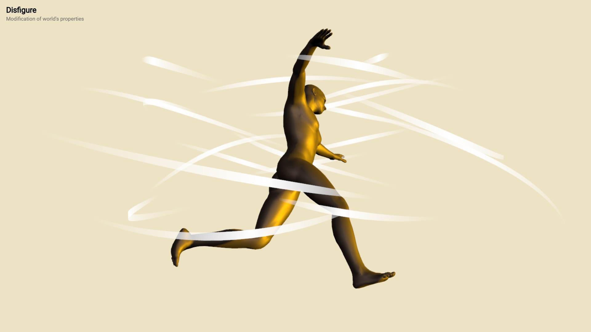](../examples/world-customize.html)


### **ground**

This variable is the ground for the default world. It creates
the illusion of a solid surface and hosts bodies' shadows.
It is an instance of [`THREE.Mesh`](https://threejs.org/docs/#api/en/objects/Mesh)
 shaped by [`PlaneGeometry`](https://threejs.org/docs/#api/en/geometries/PlaneGeometry). 


### **controls**

The navigation controls for the default world. It allows the
user to rotate and move the camera within the world. It is
an instance of [`OrbitControls`](https://threejs.org/docs/#examples/en/controls/OrbitControls). 


### **stats**

A statistics panel used to show the current the performance
of rendering the default world. It is an instance of [`Stats`](https://mrdoob.github.io/stats.js/).


# Others


### **random**( )<br>**random**( *min*, *max* )

Generates uniformly distributed random numbers in the interval [*min*,*max*)
&ndash; [see it](../examples/number-generators.html).
By default *min*=-1 and *max*=1. Internally uses a
pseudo-random function.

```js
figure.head.turn = random( -60, 60 );
```


### **regular**( *time* )<br>**regular**( *time*, *offset* )<br>**regular**( *time*, *offset*, *min*, *max* )

Generates an oscilating sequence of numbers in the interval [*min*,*max*]
&ndash; [see it](../examples/number-generators.html).
By default *offset*=0, *min*=-1 and *max*=1. Internally uses
the sine function. Parameter *offset* shifts the oscillation
foreward or backward in time.

```js
figure.head.turn = regular( time, 0, -60, 60 );
```


### **chaotic**( *time* )<br>**chaotic**( *time*, *offset* )<br>**chaotic**( *time*, *offset*, *min*, *max* )

Generates a chaotic (random, but gradually changing) sequence
of numbers in the interval [*min*,*max*] &ndash;
[see it](../examples/number-generators.html). By default *offset*=0,
*min*=-1 and *max*=1. Internally uses a simplex noise function.
Parameter *offset* shifts the sequence across the time, i.e. two
generators with different offsets produce different sequences.

```js
figure.head.turn = chaotic( time, 0, -60, 60 );
```


### **everybody**

An array of all created bodies. Usually used to traverse them
and do some operation on all bodies.


<div class="footnote">
	<a href="../">Home</a> &middot;
	<a href="https://github.com/boytchev/disfigure">GitHub</a> &middot; 
	<a href="https://www.npmjs.com/package/disfigure">NPM</a>
</div>