# Disfigure: User Guide


<!--## <small><small>Този документ е наличен и на [български език](userguide-bg.md).</small></small>-->


[**Figures**](#figures) <small>([creating](#creating-a-figure) &middot; [anatomy](#anatomy-of-a-figure) &middot; [posture](#figure-posture))</small>

[**Motions**](#motions) <small>([figure](#figure-motion) &middot; [animation](#figure-animation)  &middot; [generators](#number-generators) )</small>

[**Customization**](#figure-customization) <small>([accessories](#accessories) &middot; [textures](#tsl-textures) &middot; [dressing](#figure-dressing))</small>

[**Using**](#using-disfigure) <small>([world](#provisional-world) &middot; [positions](#local-positions) &middot; [CDN](#using-with-cdn) &middot; [local web server](#using-with-local-web-server) &middot; [nodes](#using-with-nodejs))</small>


# Figures

**Disfigure** is a simple library for animating human figures.


## Creating a figure

A figure is created as an instance of `Man`, `Woman` and `Child` with an optional
parameter for *height* in meters. The default heights are 1.80 for men, 1.70 for
women and 1.35 for children.


```js
var man = new Man( );
var woman = new Woman( 1.75 );
var child = new Child( 1 );
```

Live examples: [figure types](../examples/figure-type.html) and [custom heights](../examples/figure-height.html):

[](../examples/figure-type.html) [](../examples/figure-height.html)


## Anatomy of a figure

All figures have the same body structure with names for each body part that can
be manipulated. 

The central body parts are `torso`, `head`, `chest` and `waist`. Arms are `arm`,
`elbow`,`forearm` and `wrist`. Legs are `leg`, `thigh`, `knee`, `shin`, `ankle`
and `foot`. Hand fingers are `thumb`, `index`, `middle`, `ring` and `pinky`.

The names of symmetrical body parts have prefixes `l_` for left
and `r_` for right. Leftness and rightness is always in respect to the figure
itself. Fingers phalanges are named after the fingers but with suffixes `_mid`
and `_tip` (*note: thumbs have no middle phalanges*).

```js
figure.head        // head
figure.r_knee      // knee of right leg
figure.l_index     // index finger of left hand
figure.l_index_tip // tip phalange of index finger of left hand
```

Live examples: [body parts](../examples/figure-parts.html) and [fingers with phalanges](../examples/figure-fingers.html):

[](../examples/figure-parts.html) 
[](../examples/figure-fingers.html) 


## Figure posture

The `posture` property of a figure describes the rotations of all body parts.
It contains version number of an array of rotation angles. The `posture` property
can be used to push a posture to a figure. A read-only property `postureString` retrieves the posture as a string.

``` javascript
figure.posture = {version:9, angles:[[-15,44,10],[5,82,-24],...]};
figure.posture = anotherFigure.posture;

var str = figure.postureString;
```

A posture could be defined as a blend of other postures. Method `blend` mixes
two postures with a blending coefficient. When the coefficient is 0 the result
is the first posture, when it is 1 the result is the second and when it is between
0 and 1 the result is a posture between both postures.

``` javascript
figure.blend( initialPosture, finalPosture, 0.5 );
```

Live examples: [posture data](../examples/figure-posture.html) and [posture blending](../examples/figure-blend.html):

[](../examples/figure-posture.html) 
[](../examples/figure-blend.html) 


# Motions

The motion of a figure is done by manipulating properties of the figure or its
body parts.


## Figure position

The position of the figure within the 3D is controlled by its
`.position` property with subproperties `.x`, `.y` and `.z`. Technically, the
position is [`Vector3`](https://threejs.org/docs/#Vector3) object.

``` javascript
figure.position.set( 1, 0, 0.5 );
figure.position.y = -0.1;
```

Live examples: [figure position](../examples/figure-position.html) and [figure motion](../examples/figure-motion.html):

[](../examples/figure-position.html) 
[](../examples/figure-motion.html) 


## Figure motion

Each figure has three main axes:

* X axis: (aka shoulder axis) horizontal left-right direction
* Y axis: (aka head axis) vertical top-bottom direction
* Z axis: (aka chest axis) horizontal front-back direction

Body parts have properties `.x`, `.y` and `.z` which define the rotation around
the corresponding axes. Angles of rotations are in degrees.

#### Central body

The central body contains body parts in the middle of the figure &ndash; `head`,
`chest`, `waist` and the `torso`. They have no left and right variants. The motions of central body parts follow the same axes of rotations.

* positive X direction is bending forward, negative is backward
* positive Y direction is turning left, negative is right
* positive Z direction is tilting left, negitive is right

``` javascript
figure.head.x = 40;
figure.chest.z = 10;
figure.waist.z = -30;
```

Live examples: [axes of rotations](../examples/motion-axes.html) and [motion of head, chest and waist](../examples/motion-torso.html):

[](../examples/motion-axes.html) 
[](../examples/motion-torso.html) 

#### Legs and arms

A leg is made of `leg`, `thigh`, `knee`, `shin`, `ankle` and `foot`. An arm is
made of `arm`, `elbow`, `forearm` and `wrist`. These body parts are left and
right and the rotation around Y and Z axes is symmetrical and horizontally
flipped as if mirrored. Note that some motions might look counterintuitive when
two or three rotation are applied on the same body part. This is due to rotations
being non-commutative.

``` javascript
figure.l_knee.x = 40;
figure.r_ankle.x = 10;
figure.l_elbow.y = 45;
figure.r_wrist.z = -20;
```

Live examples: [motion of legs](../examples/motion-legs.html) and [motion of arms](../examples/motion-arms.html):

[](../examples/motion-legs.html) 
[](../examples/motion-arms.html) 

#### Fingers

Only hand fingers are presented as individual body parts. Fingers are `thumb`,
`index`, `middle`, `ring` and `pinky`. They are always used with prefixes `l_`
or `r_`. Fingers have phalanges which are identified with sufix `_mid` (for middle)
and `_tip` (for end) phalange. Note that the thumb has no middle phalange.

``` javascript
figure.l_thumb.x = 20;
figure.r_index.z = 45;
figure.r_index_mid.z = 30;
figure.r_index_tip.z = 15;
```

Live examples: [motion of fingers](../examples/motion-fingers.html) and [motion of phalanges](../examples/motion-phalanges.html):

[](../examples/motion-fingers.html) 
[](../examples/motion-phalanges.html) 


## Figure animation

A default Disfigure world manages figure animation in two ways &ndash; via
animation loop or animation event. The function `setAnimationLoop` registers
a user-defined function that is called automatically each frame. The function
accepts a parameter `time` with the current time in milliseconds. 

```javascript
setAnimationLoop( animate );

function animate( time ) {
   
   // executed once per frame
   
}
```

Alternatively the `window` object may listen to `animate` events that are
generated every frame with property `event.time` holds the current time in
milliseconds. The `animate` event is also sent to individual figures and in this
case the figure itself is in `event.target`.

```javascript
window.addEventListener( 'animate', animate );

function animate ( event ) {

   var time = event.time;

   // executed once per frame
   
}

figure.addEventListener( 'animate', animate );

function animate ( event ) {

   var time = event.time,
       figure = event.target;

   // executed once per frame
   
}
```

Live examples: [animation loop](../examples/motion-loop.html) and [animation event](../examples/motion-event.html):

[](../examples/motion-loop.html)
[](../examples/motion-event.html)


## Number generators

Disfiure provide three number generators &ndash; these are functions that
generate sequences of numbers used in animations. The `random` generator creates
uniformly distributed random numbers within interval. The `regular` generator
creates oscillation of values within interval. The `chaotic` generator combines
randomness and smoothness &ndash; it creates smoothe sequence of numbers that
gradually oscillate between randomly selected values in interval.

Random generator needs only interval, while regular and chaotic generators need
time, offset and interval.

```javascript
figure1.head.y = random( -30, 30 );
figure2.head.y = regular( time, 0, -30, 30 );
figure3.head.y = chaotic( time, 0, -30, 30 );
```

Live examples: [generators graphs](../examples/motion-generators-graphs.html) and [generators animations](../examples/motion-generators.html):

[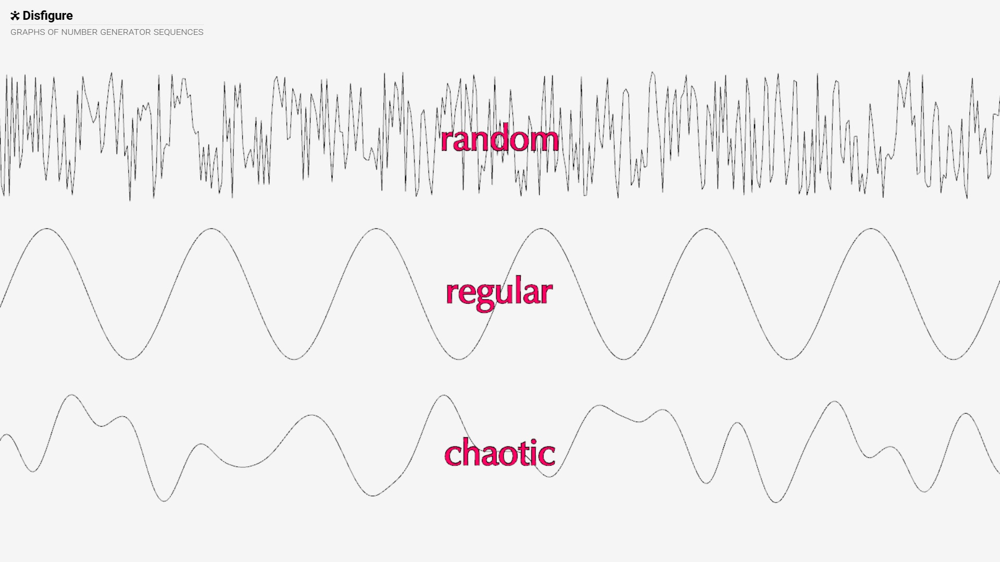](../examples/motion-generators-graphs.html)
[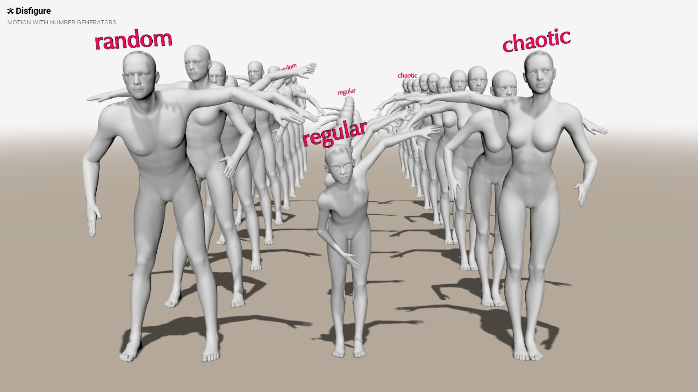](../examples/motion-generators.html)


# Figure customization

## Accessories

Accessories are Three.js objects attached to a specific body part. They do not
deform, but move as if attached to the body. The accessory own *position* and
*rotation* properties are in respect to the origin of the hosting body part.

``` javascript
figure.l_arm.attach(object);
```

Live examples: [attach one accessory](../examples/figure-accessory.html) and [many acccessories](../examples/figure-accessor.html):

[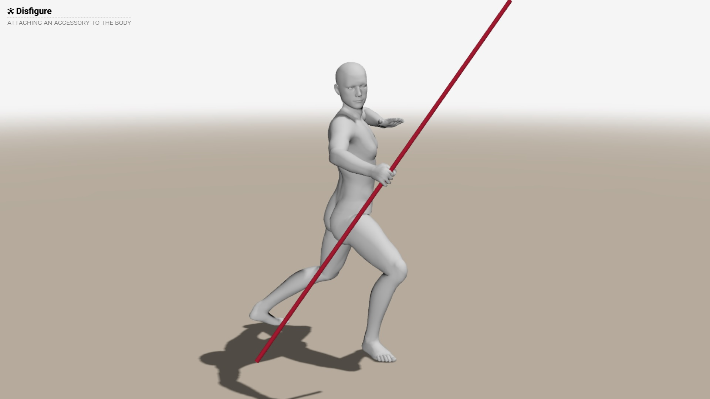](../examples/figure-accessory.html) 
[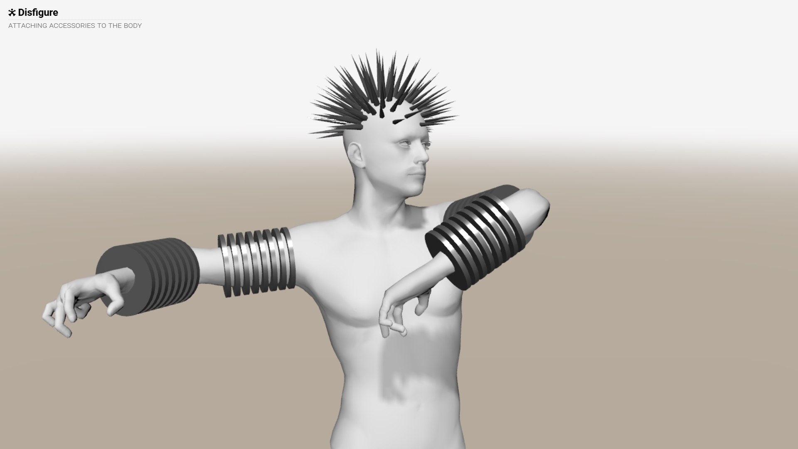](../examples/figure-accessories.html) 


## TSL textures

Disfigure is compatible with most [TSL Textures](https://boytchev.github.io/tsl-textures/)
&ndash; real-time textures generated via TSL. To use a TSL Texture it must be
imported as well as all Three.js classex that are used. Textures are provided as
functions. The result of these functions are to be assigned to material nodes,
usually `.colorNode`.

```javascript
import * as Three from "three";
import { camouflage } from "https://cdn.jsdelivr.net/npm/tsl-textures@3.0.1/dist/tsl-textures.min.js";
:
figure.material.colorNode = camouflage ( {
	scale: 3,
	colorA: new Three.Color(12762792),
	colorB: new Three.Color(10258782),
	colorC: new Three.Color(9610101),
	colorD: new Three.Color(7435617),
} );
```

Live examples: [single texture](../examples/clothes-tsl-texture.html) and [multiple textures](../examples/clothes-tsl-textures.html):

[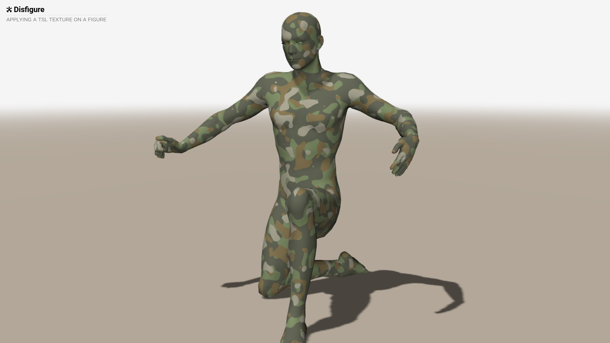](../examples/clothes-tsl-texture.html)
[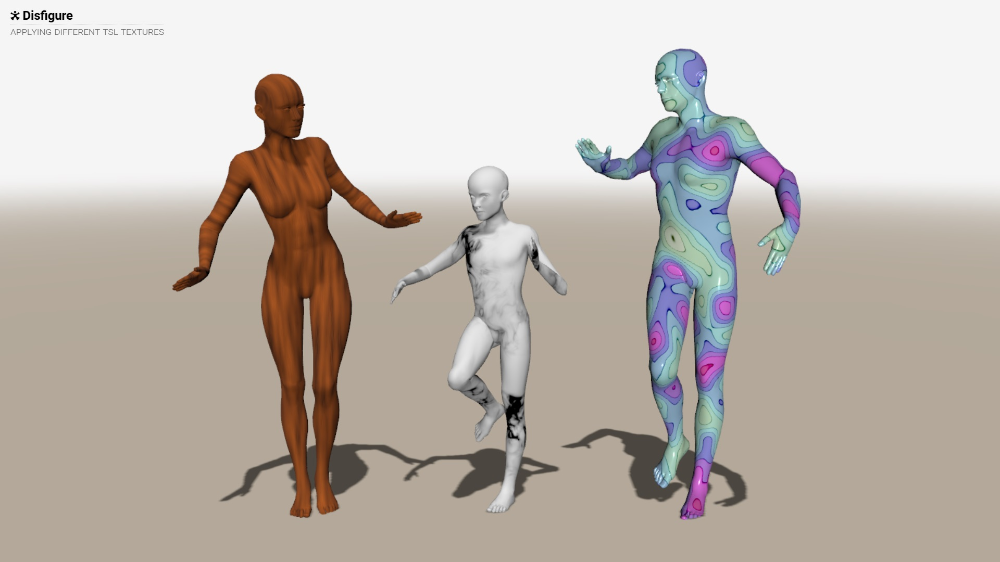](../examples/clothes-tsl-textures.html)


## Figure dressing

Disfigure supports a painting interface to draw simple shapes directly onto the
surface of a figure. The `dress` method of a figure sets its clothing - an array
of range and material functions. The range function selects a portion of the
figure surface, called *slice*, and the material function applies a clothing
material to it. The structure of the clothing is:

```javascript
[
   material,            // default clothing material
   
   slice_1, material_1, // optional clothing materials
   slice_2, material_2,
   ...
   slice_N, material_N
]
```

The *material* is the mandatory default clothing material for the whole figure.
The next optional *slice-material* pairs define slices and materials for each slice.

``` javascript
figure.dress([

   velour( 'black' ),

   slice( 1.1, 2, {angle: -20} ),
   velour( 'red' ),

   slice( 1.15, 2, {angle: 35} ),
   velour( 'red' ),
   ...
];
```


Live example: [uniform](../examples/clothes-uniform.html):

[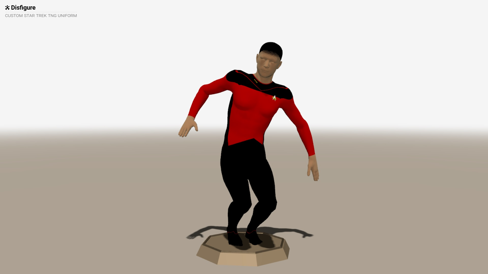](../examples/clothes-uniform.html)


The clothing materials *velour* and *latex* define matte and shiny material.
They both accept a *color* parameter is either a [Three.js color](https://threejs.org/docs/#Color)
or a [HTML/CSS color name](https://www.w3schools.com/colors/colors_names.asp).

``` javascript
velour( 'green' )
latex( 'red' )
```

Live examples: [velour clothing](../examples/clothes-velour.html) and [latex clothing](../examples/clothes-latex.html):

[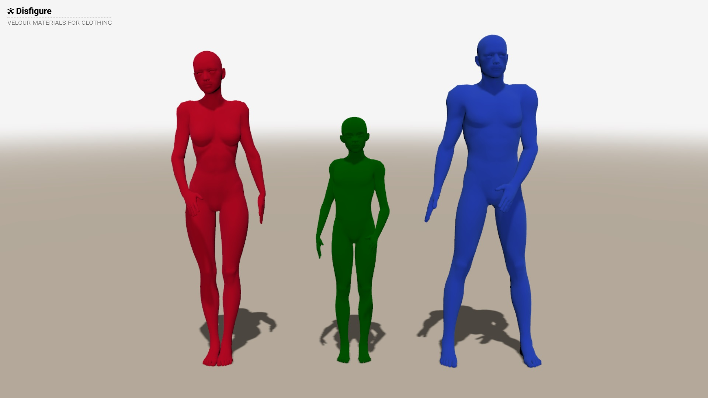](../examples/clothes-velour.html)
[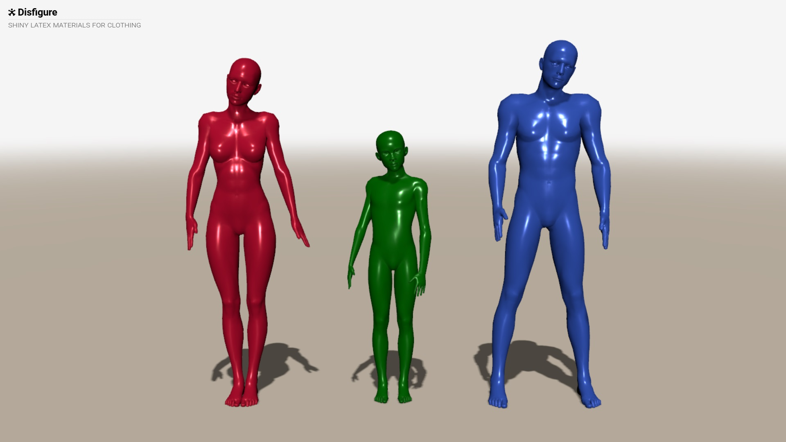](../examples/clothes-latex.html)


Two clothing materials could be combined by *bands* of given *width*, alternating
them horizontally, vertically or diagonally. Optional parameters provides
additional properties for the bands. Adequate blurring of the bands may improve
their visual appearance, especially when they are too close or too far.

Polar bands revolve around a vertical axis. They are more suitable for bands
that go around a body part.

```javascript
bands(
   latex( 'crimson' ),
   velour( 'azure' ),
   0.015,
   { balance: 0.9, blur: 0.2, angle: 90 }
)
```

Live examples: [bands](../examples/clothes-bands.html) and [polar bands](../examples/clothes-bands-polar.html):

[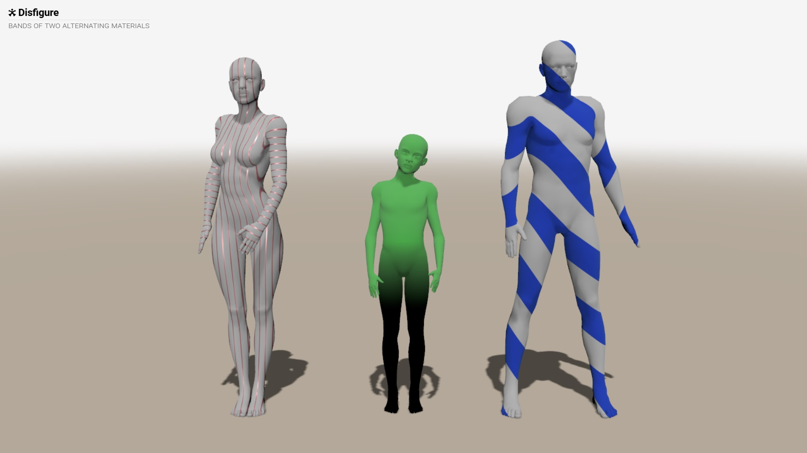](../examples/clothes-bands.html)
[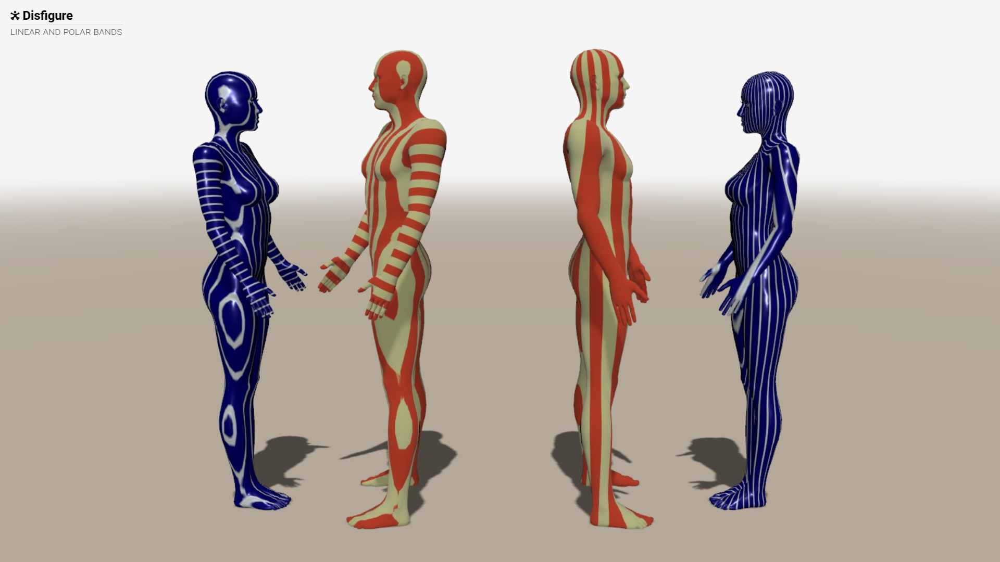](../examples/clothes-bands-polar.html)


The *slice* function defines a slice of a figure &ndash; this is a part
of the figure that is dressed in given material. Parameters *from* and *to*
define the start and the end of the slice, measured in meters. By default,
a slice is horizontal, thus *from* and *to* denote distance from the ground.
The optional *options* parameter provides additional properties for the slice
like their orientation and symmetry.

```javascript
slice( -0.07, 0.03, {front: true} )
slice( 0.70, 1.40, {angle:55} )
```

Live examples: [slice](../examples/clothes-slice.html) and [angled slice](../examples/clothes-slice-angle.html):

[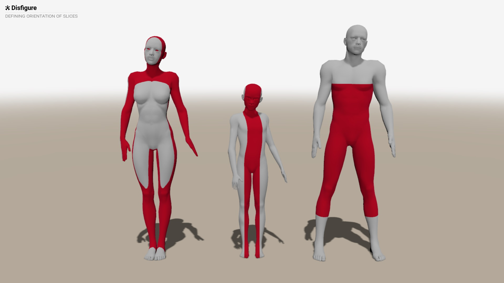](../examples/clothes-slice.html)
[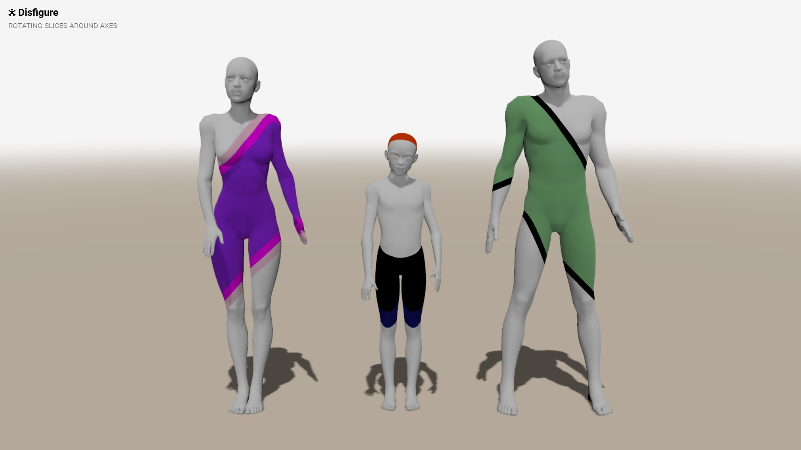](../examples/clothes-slice-angle.html)


Additionally, slices could be curved as a wave when a non-zero *wave* option is provided.

```javascript
slice( 1.3, 2, {wave:0.15, width:0.1, sharpness:1} )
```

Live example: [slice wave](../examples/clothes-slice-wave.html):

[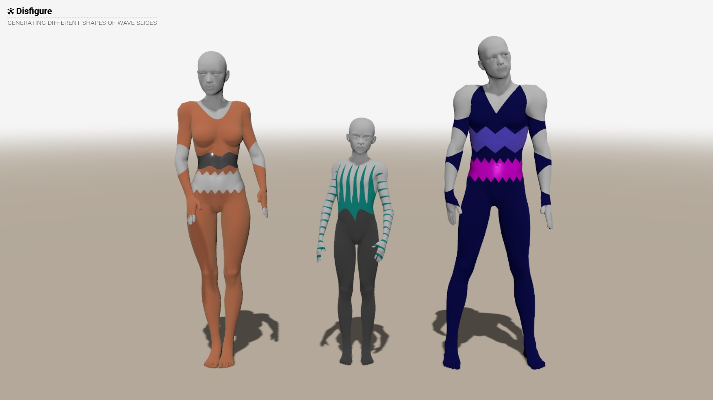](../examples/clothes-slice-wave.html)


Slices can be combined into more complex shapes by intersecting or uniting them.
The function `and` intersects two slices, e.g. *slice_1.and(slice_2)* generates
a slice containing all points both in *slide_1* **and** in *slide_2*, while `or`
unites two slices, e.g. *slice_1.or(slice_2)* generates a slice containing all
points either in *slide_1* **or** in *slide_2*.

```javascript
slice( -0.1, 1.1, {angle:45, wave: 0.3, width:0.02} )
   .and( slice( -0.3, 0.9, {angle:-45, wave: 0.3, width:0.02} ) )
   .or( slice( -0.2, 0.2 ) )
```

Live example: [combining slices](../examples/clothes-slice-and-or.html):

[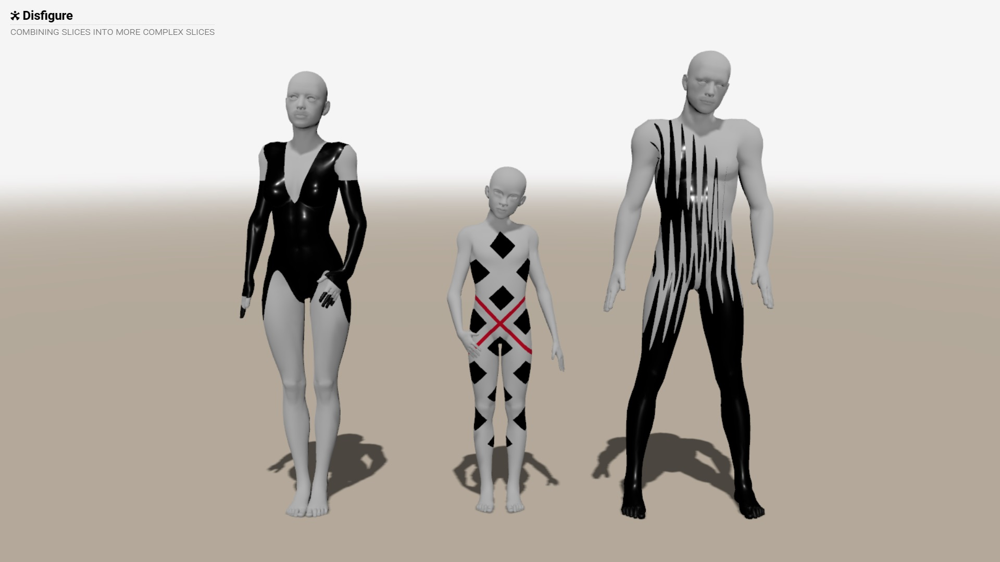](../examples/clothes-slice-and-or.html)


# Using Disfigure

## Provisional world

Disfigure provides a predefined default 3D world with all basic options,
like camera, lights, ground, user navigations and so on.

Options for the environment:

- *antialias* &ndash; boolean, if false, antialias is turned off (default is true)
- *ground* &ndash; boolean, if false, ground is not created (default is true)
- *lights* &ndash; boolean; if false, lights are not created (default is true)
- *shadows* &ndash; boolean, if false, shadows are not created (default is true)
- *controls* &ndash; boolean, if false, orbit controls is not created (default is true)
- *stats* &ndash; boolean, if true, stats panel is created (default is false)

Options for figure:

- *men* &ndash; number, allocated number of men figures (default is 3)
- *women* &ndash; number, allocated number of women figures (default is 3)
- *children* &ndash; number, allocated number of children figures (default is 3)
- *population* &ndash; number, allocated number of figures (may differ from men+women+children, default is 9)
- *smooth* &ndash; boolean, if false, render figures with low-quality but faster smoothing (default is true)
- *lowpoly* &ndash; number 0 to 1, reduction factor for figure complexity (default is 0, no reduction)

```js
new World( {ground: false, stats: true, men:100} );
```

If a provisional world instance is created, it adds global variables:

- *renderer* &ndash; WebGPU renderer
- *scene* &ndash; default scene for all figures
- *camera* &ndash; perspetive camera
- *light* &ndash; static directional light with shadows
- *cameraLight* &ndash; dynamic directional light

Depending on options initialing a world may also create:

- *ground* &ndash; ground for illusion of a solid surface
- *controls* &ndash; orbit controls for primary navigation
- *stats* &ndash; stats panel for performance monitoring

It is not compulsory to the a provisional world. A program may dafine its
custom Three.js world. In this case the figures should be added to the
scene via their *pool* property, and the animation loop must call *update*
method:

```js
var man = new Man( );

scene.add( man.pool );

function animationLoop( t ) {

	man.update();
	...
	renderer.render( scene, camera );
}
```


Live examples: [variation of default world](../examples/world-custom.html) and [customized world](../examples/world-custom.html):

[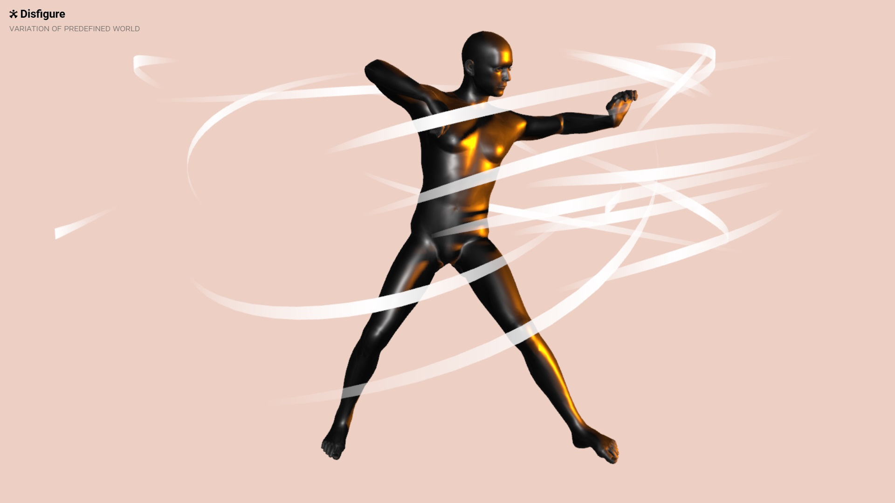](../examples/world-default.html)
[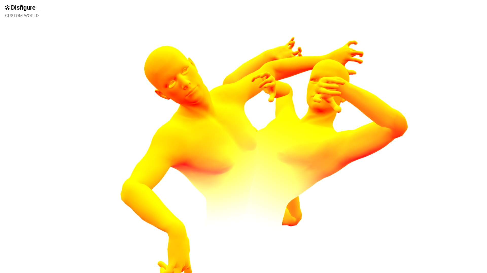](../examples/world-custom.html)


## Local positions

Disfigure provides additional methods for querying and managing positions
besides the traditional `.position` property.

The `pointAt` method extracts the global coordinates of a point related to
a body part. Each body part has own coordinate system and the point is defined
in this local coordinate system. 

The `lockTo` moves the whole figure so that the local point of a body part is
mapped to the global point. This can be used to keep a figure standing on the
ground (by locking its feet to level 0).


``` javascript
pos = figure.l_arm.pointAt(0,0.1,0);

figure.l_wrist.lockTo(0,1.5,0,0.2, -0.01,0.01);
```

[](../examples/???pointat.html)
[](../examples/???lockto.html)


## Using with CDN

[Content Delivery Network (CDN)](https://en.wikipedia.org/wiki/Content_delivery_network). 
serves as a host of the library files. At the time of writing this document
it is recommended to use [jsDelivr](https://cdn.jsdelivr.net) as CDN. Other
CDNs are also available.

The main advantages of using a CDN are:

* there is no need to install disfigure.js
* there is no need to install node.js or another JS module manager
* there is no need to install a local web server
* a user file can be directly run in a browser

The main disadvantages of using a CDN are:

* internet access to the CDN is required at program startup
* pointers to three.js and disfigure.js must be defined as importmaps

A minimal program that uses Disfigure.js from a CDN needs to define 4 import
maps: `three`, `three/webgpu`, `three/tsl` and `three/addons`. Preferably
`disfigure` could also be defined.


```html
<!DOCTYPE html>

<script type="importmap">
  {
    "imports": {
      "three": "https://cdn.jsdelivr.net/npm/three@0.184.0/build/three.webgpu.min.js",
      "three/webgpu": "https://cdn.jsdelivr.net/npm/three@0.184.0/build/three.webgpu.min.js",
      "three/tsl": "https://cdn.jsdelivr.net/npm/three@0.184.0/build/three.tsl.min.js",
      "three/addons/": "https://cdn.jsdelivr.net/npm/three@0.184.0/examples/jsm/",
      "disfigure": "https://cdn.jsdelivr.net/gh/boytchev/disfigure@main/dist/disfigure.min.js"
    }
  }
</script>

<script type="module">

  import {World, Man} from 'disfigure';

  new World;
  new Man;

</script>
```

Live example: [minimal CDN](../examples/minima-cdn.html):

[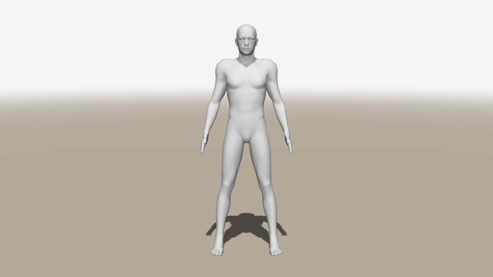](../examples/world-default.html)


Note: many of the examples in this document use the script `importmap.js`
to generate the import maps and inject them in the page. This is done solely
for maintaining shorter code and to easily switch to other versions of either
Three.js or Disfigure.js.


## Using with local web server

A local web server could provide files just as CDN. The only change is the 
importmap &ndash; it should point the local files. Note that all files must
be accessed via `https`. 

The main advantages of using only local files are:

* no internet access is required
* no need to install node.js or another JS module manager
* protection from a breaking change in the online libraries
* a user file can be directly run in a browser
* user code can use modules and can be split in several files

The main disadvantages of using only local files are:

* disfigure.js and used three.js files must be downloaded
* a local web server must be installed
* pointers to local three.js and disfigure.js must be still defined as importmaps


## Using with node.js

The library is provided as a NPM package. If node.js is installed on the user
machine, it should be possible to install disfigure.js and use it directly.

The main advantages of using node.js:

* no internet access is required once the package installation is done
* no need to use import maps (the whole importmaps section can be omitted)
* protection from a breaking change in the online libraries

The main disadvantages of using using node.js:

* node.js, three.js and disfigure.js must be installed

Note: This approach is not tested. If you find that it is not working and you
know how to fix it, please get in touch.


<div class="footnote">
	<a href="../">Home</a> &middot;
	<a href="https://github.com/boytchev/disfigure">GitHub</a> &middot; 
	<a href="https://www.npmjs.com/package/disfigure">Legacy NPM</a>
</div>