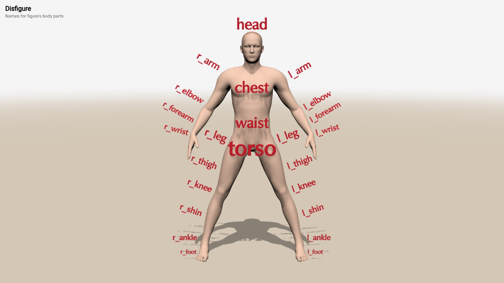
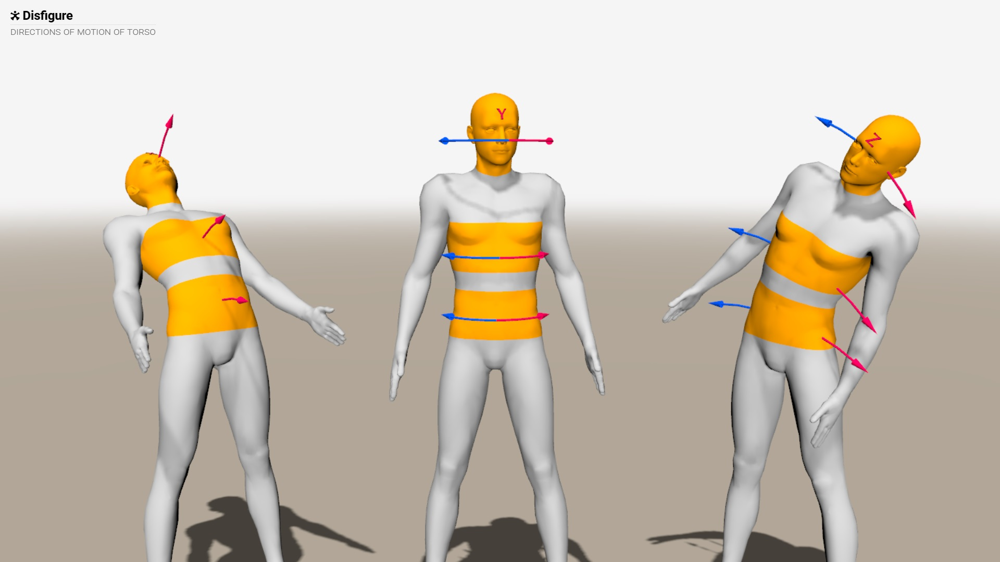
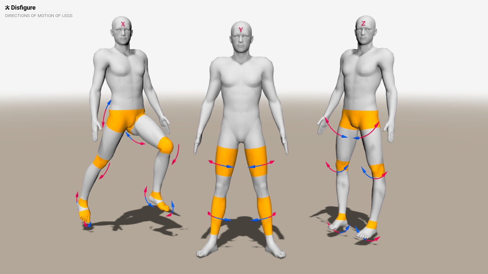
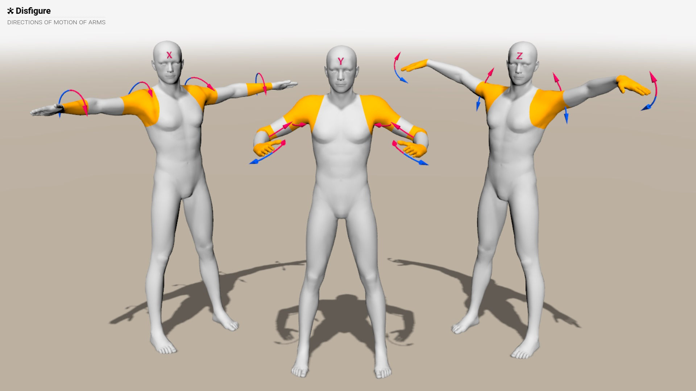
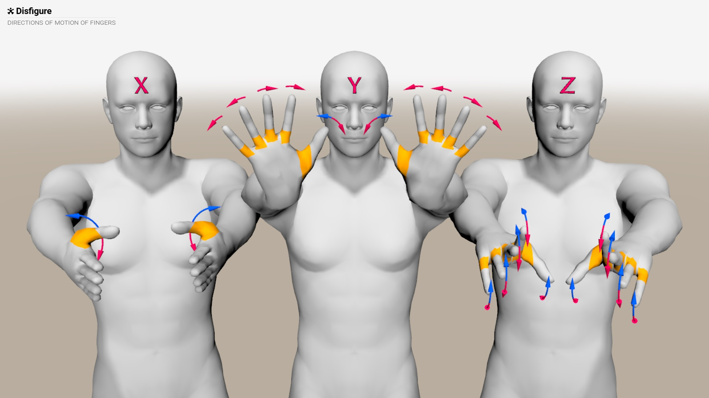
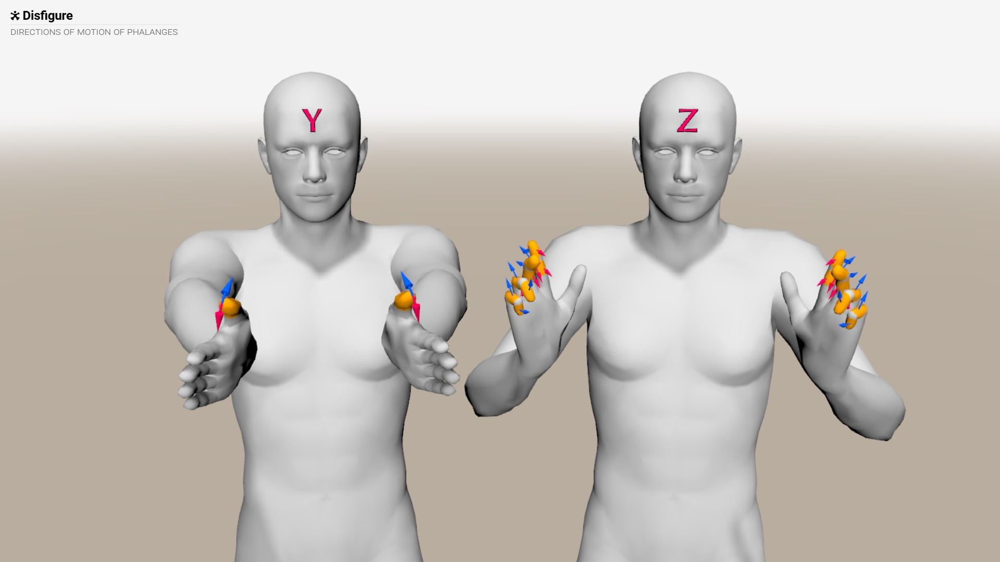
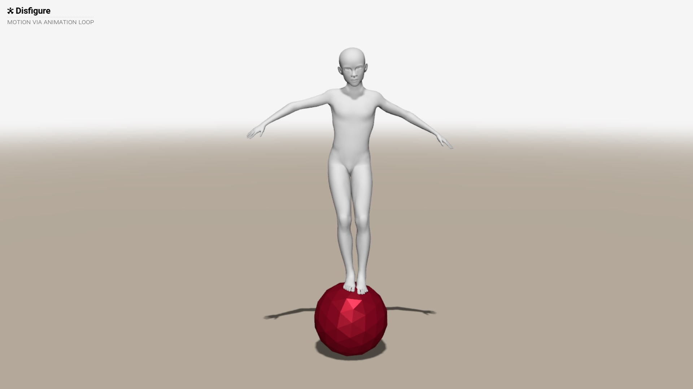
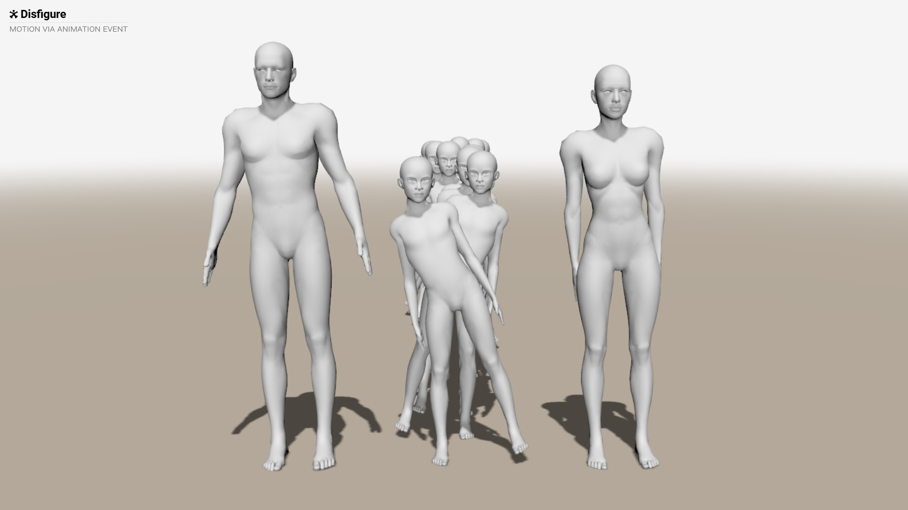
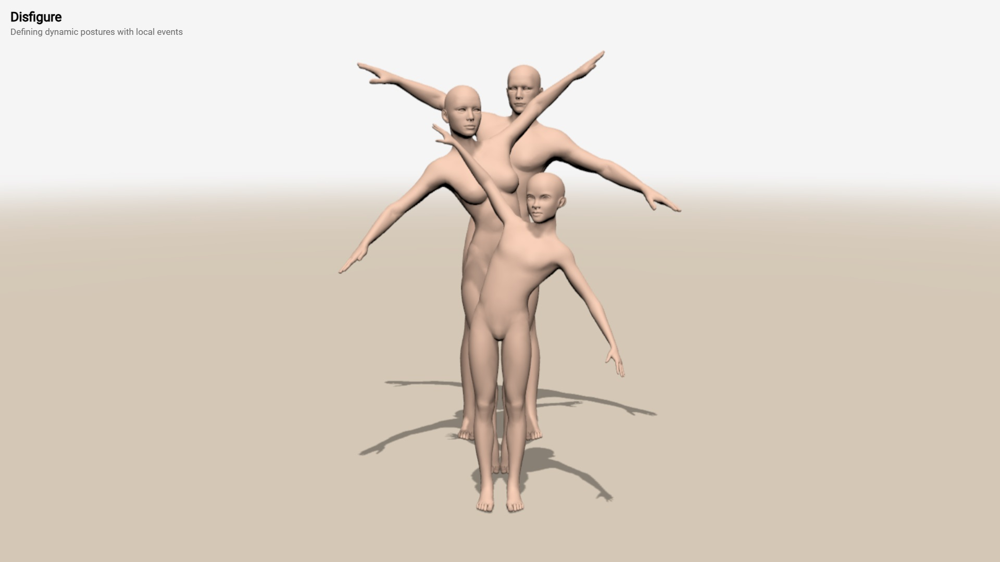

# Disfigure: User Guide


<!--## <small><small>Този документ е наличен и на [български език](userguide-bg.md).</small></small>-->


[**Figures**](#figures) <small>([creating](#creating-a-figure) &middot;  [anatomy](#anatomy-of-a-figure) &middot; [posture](#figure-posture))</small> [**Motions**](#motions) <small>([figure](#figure-motion) &middot; [animation](#figure-animation) )</small>


# Figures

**Disfigure** is a simple library for animating human figures.


## Creating a figure

A figure is created as an instance of `Man`, `Woman` and `Child` with an optional
parameter for *height* in meters. The default heights are 1.80 for men, 1.70 for
women and 1.35 for children.


```js
var man = new Man( );
var woman = new Woman( 1.75 );
var child = new Child( 1 );
```

Live examples: [figure types](../examples/figure-type.html) and [custom heights](../examples/figure-height.html):

[](../examples/figure-type.html) [](../examples/figure-height.html)


## Anatomy of a figure

All figures have the same body structure with names for each body part that can
be manipulated. 

The central body parts are `torso`, `head`, `chest` and `waist`. Arms are `arm`,
`elbow`,`forearm` and `wrist`. Legs are `leg`, `thigh`, `knee`, `shin`, `ankle`
and `foot`. Hand fingers are `thumb`, `index`, `middle`, `ring` and `pinky`.

The names of symmetrical body parts have prefixes `l_` for left
and `r_` for right. Leftness and rightness is always in respect to the figure
itself. Fingers phalanges are named after the fingers but with suffixes `_mid`
and `_tip` (*note: thumbs have no middle phalanges*).

```js
figure.head        // head
figure.r_knee      // knee of right leg
figure.l_index     // index finger of left hand
figure.l_index_tip // tip phalange of index finger of left hand
```

Live examples: [body parts](../examples/figure-parts.html) and [fingers with phalanges](../examples/figure-fingers.html):

[](../examples/figure-parts.html) 
[](../examples/figure-fingers.html) 


## Figure posture

The `posture` property of a figure describes the rotations of all body parts.
It contains version number of an array of rotation angles. The `posture` property
can be used to push a posture to a figure. A read-only property `postureString` retrieves the posture as a string.

``` javascript
figure.posture = {version:9, angles:[[-15,44,10],[5,82,-24],...]};
figure.posture = anotherFigure.posture;

var str = figure.postureString;
```

A posture could be defined as a blend of other postures. Method `blend` mixes
two postures with a blending coefficient. When the coefficient is 0 the result
is the first posture, when it is 1 the result is the second and when it is between
0 and 1 the result is a posture between both postures.

``` javascript
figure.blend( initialPosture, finalPosture, 0.5 );
```

Live examples: [posture data](../examples/figure-posture.html) and [posture blending](../examples/figure-blend.html):

[](../examples/figure-posture.html) 
[](../examples/figure-blend.html) 


# Motions

The motion of a figure is done by manipulating properties of the figure or its
body parts.


## Figure position

The position of the figure within the 3D is controlled by its
`.position` property with subproperties `.x`, `.y` and `.z`. Technically, the
position is [`Vector3`](https://threejs.org/docs/#Vector3) object.

``` javascript
figure.position.set( 1, 0, 0.5 );
figure.position.y = -0.1;
```

Live examples: [figure position](../examples/figure-position.html) and [figure motion](../examples/figure-motion.html):

[](../examples/figure-position.html) 
[](../examples/figure-motion.html) 


## Figure motion

Each figure has three main axes:

* X axis: (aka shoulder axis) horizontal left-right direction
* Y axis: (aka head axis) vertical top-bottom direction
* Z axis: (aka chest axis) horizontal front-back direction

Body parts have properties `.x`, `.y` and `.z` which define the rotation around
the corresponding axes. Angles of rotations are in degrees.

#### Central body

The central body contains body parts in the middle of the figure &ndash; `head`,
`chest`, `waist` and the `torso`. They have no left and right variants. The motions of central body parts follow the same axes of rotations.

* positive X direction is bending forward, negative is backward
* positive Y direction is turning left, negative is right
* positive Z direction is tilting left, negitive is right

``` javascript
figure.head.x = 40;
figure.chest.z = 10;
figure.waist.z = -30;
```

Live examples: [axes of rotations](../examples/motion-axes.html) and [motion of head, chest and waist](../examples/motion-torso.html):

[](../examples/motion-axes.html) 
[](../examples/motion-torso.html) 

#### Legs and arms

A leg is made of `leg`, `thigh`, `knee`, `shin`, `ankle` and `foot`. An arm is
made of `arm`, `elbow`, `forearm` and `wrist`. These body parts are left and
right and the rotation around Y and Z axes is symmetrical and horizontally
flipped as if mirrored. Note that some motions might look counterintuitive when
two or three rotation are applied on the same body part. This is due to rotations
being non-commutative.

``` javascript
figure.l_knee.x = 40;
figure.r_ankle.x = 10;
figure.l_elbow.y = 45;
figure.r_wrist.z = -20;
```

Live examples: [motion of legs](../examples/motion-legs.html) and [motion of arms](../examples/motion-arms.html):

[](../examples/motion-legs.html) 
[](../examples/motion-arms.html) 

#### Fingers

Only hand fingers are presented as individual body parts. Fingers are `thumb`,
`index`, `middle`, `ring` and `pinky`. They are always used with prefixes `l_`
or `r_`. Fingers have phalanges which are identified with sufix `_mid` (for middle)
and `_tip` (for end) phalange. Note that the thumb has no middle phalange.

``` javascript
figure.l_thumb.x = 20;
figure.r_index.z = 45;
figure.r_index_mid.z = 30;
figure.r_index_tip.z = 15;
```

Live examples: [motion of fingers](../examples/motion-fingers.html) and [motion of phalanges](../examples/motion-phalanges.html):

[](../examples/motion-fingers.html) 
[](../examples/motion-phalanges.html) 


## Figure animation

A default Disfigure world manages figure animation in two ways &ndash; via
animation loop or animation event. The function `setAnimationLoop` registers
a user-defined function that is called automatically each frame. The function
accepts a parameter `time` with the current time in milliseconds. 

```javascript
setAnimationLoop( animate );

function animate( time ) {
   
   // executed once per frame
   
}
```

Alternatively the `window` object may listen to `animate` events that are
generated every frame with property `event.time` holds the current time in
milliseconds.

```javascript
window.addEventListener( 'animate', animate );

function animate ( event ) {

   var time = event.time;

   // executed once per frame
   
}
```

Live examples: [animation loop](../examples/motion-loop.html) and [animation event](../examples/motion-event.html):

[](../examples/motion-loop.html)
[](../examples/motion-event.html)

<!--
The *animate* event is triggered to each figure. In this case
the activating figure is stored in the property `event.target`.
This allows the same animation to be applied to several figures
&ndash; [see it](../examples/posture-events-local.html).

```javascript
figure.addEventListener( 'animate', animate );

function animate ( event ) {
		
   // executed once per frame
   
   var time = event.time;
   var figure = event.target;

}
```

[](../examples/posture-events-local.html)

-->


<div class="footnote">
	<a href="../">Home</a> &middot;
	<a href="https://github.com/boytchev/disfigure">GitHub</a> &middot; 
	<a href="https://www.npmjs.com/package/disfigure">Legacy NPM</a>
</div>