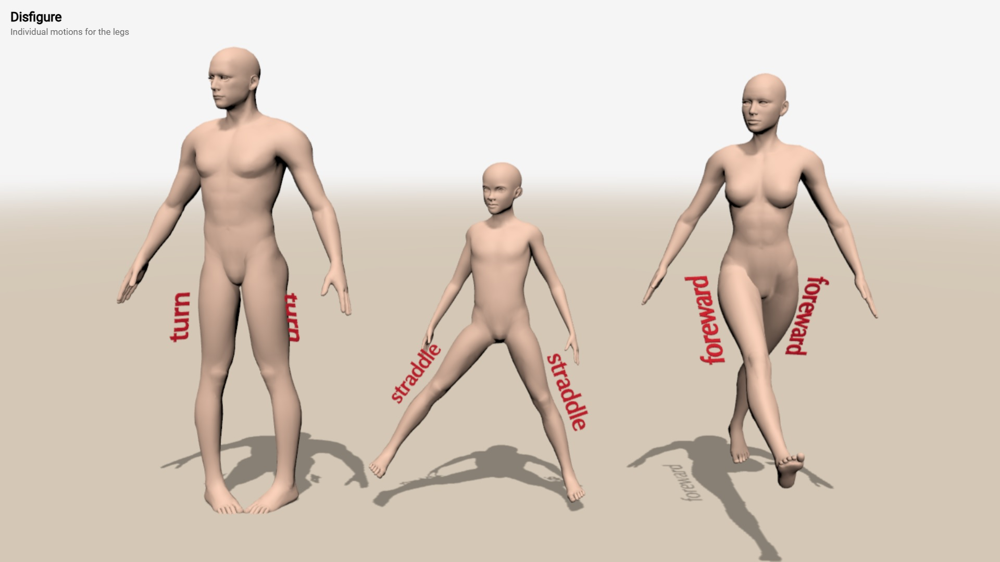
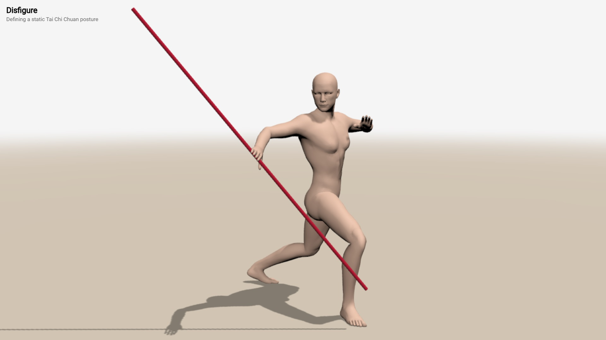

# Disfigure: User Guide


## <small><small>[Figures](#figures-shapes) &middot; [Motions](#figure-motions) &middot; [Postures](#figure-postures) &middot; [Customizations](#figure-customizations) &middot; [Worlds](#predefined-world) &middot; [Others](#others)</small></small>


<!--## <small><small>Този документ е наличен и на [български език](userguide-bg.md)</small></small>-->

Disfigure is a library for animating human figures by modifying
a matrix field of the space around them. Here is an absurdly
minimal demo &ndash; [see it live](../examples/minimal.html).

```js
import * as Happy from 'disfigure'
	
new Happy.World
new Happy.Man
```

# Figure shapes

### new **Man**( *height* )<br>new **Woman**( *height* )<br>new **Child**( *height* )

Disfigure defines figures as instances of classes `Man`, `Woman`
and `Child` &ndash; [see it](../examples/figure-create-basic.html).
The optional parameter *height* defines the height of a figure
in meters &ndash; [see it](../examples/figure-create-height.html).
By default a man is 1.80m, a woman is 1.70m and a child is 1.35m.

```js
var man = new Happy.Man( 1.90 );
var woman = new Happy.Woman( );
```

[](../examples/figure-create-basic.html)
[](../examples/figure-create-height.html)

All types of figures have the exact same structure with names
corresponding to body parts, like `head` and `chest`. Left and
right body parts are always in respect to the figure. Their
names have prefixes `l_···` for left and `r_···` for right, so
there is `l_knee` and `r_knee` &ndash; [see it](../examples/figure-parts.html):

* **Whole body** &ndash; `torso`
* **Central parts** &ndash; `head`, `chest`, `waist`
* **Upper limbs** &ndash; `arm`, `elbow`, `forearm`, `wrist`
* **Lower limbs** &ndash; `leg`, `thigh`, `knee`, `shin`, `ankle`, `foot`

[](../examples/figure-parts.html)


# Figure motions

## Central parts

The motion of a figure is done by manipulating properties of
body parts. Motions are just rotations measured in degrees.

### figure.**torso**<br>figure.**head**<br>figure.**chest**<br>figure.**waist**

The `torso` is the root body part and its rotation affects
the whole body. Torso has properties `bend`, `turn` and `tilt`
&ndash; [see it](../examples/motion-torso.html). The central
body parts are `head`, `chest` and `waist`. They have the
same set of properties as the torso &ndash;
[see it](../examples/motion-central.html).

* `bend` &ndash; bends foreward or backward
* `turn` &ndash; turns to the left or right
* `tilt` &ndash; tilts sideways to the left or right

```js
figure.torso.bend = 40;
figure.head.bend = 40;
figure.chest.turn = -20;
figure.waist.tilt = 35;
```

[](../examples/motion-torso.html)
[](../examples/motion-central.html)


## Upper limbs


### figure.**l_arm**<br>figure.**r_arm**

The upper limbs are symmetrical body parts with multiple joints
and rotation properties that recreate a complex and flexible
motion &ndash; [see it](../examples/motion-limbs-upper.html).
Arms have `foreward`, `turn` and `straddle` &ndash;
[see it](../examples/motion-arm.html).

* `foreward` &ndash; moves an arm foreward (or backward)
* `turn` &ndash; turns an arm inwards (or outwards)
* `straddle` &ndash; moves an arm sideways to the body (or away from the body)

``` javascript
figure.r_arm.foreward = 70;
figure.r_arm.straddle = -30;
figure.r_arm.turn = 5;
```

[](../examples/motion-limbs-upper.html)
[](../examples/motion-arm.html)


### figure.**l_elbow**<br>figure.**r_elbow**

Elbows `l_elbow` and `r_elbow` have limited motions. Elbows
have only `bend` &ndash; [see it](../examples/motion-elbow.html).

* `bend` &ndash; bends an elbow towards the body (or away from the body)

``` javascript
figure.r_elbow.bend = 45;
```

[](../examples/motion-elbow.html)


### figure.**l_forearm**<br>figure.**r_forearm**

Forearms `l_forearm` and `r_forearm` have limited motions.
Forearms have only `turn` &ndash; [see it](../examples/motion-forearm.html).

* `turn` &ndash; turns a forearm inwards (or outwards)

``` javascript
figure.r_forearm.turn = -20;
```

[](../examples/motion-forearm.html)


### figure.**l_wrist**<br>figure.**r_wrist**

Wrists `l_wrist` and `r_wrist` support `bend` and `tilt` &ndash;
[see it](../examples/motion-wrist.html). Wrist have no turns,
as turning is done in the forearm or the arm.

Motions of `l_wrist` and `r_wrist`:

* `bend` &ndash; bends a wrist down or up
* `turn` &ndash; turns a wrist foreward or backward

``` javascript
man.r_wrist.bend = -60;
man.r_wrist.tilt = 10;
```

[](../examples/motion-wrist.html)


## Lower limbs

### figure.**l_leg**<br>figure.**r_leg**

The lower limbs are symmetrical body parts with multiple joints
and rotation properties that recreate a complex and flexible
motion &ndash; [see it](../examples/motion-limbs-lower.html).
Legs have `foreward`, `straddle` and `turn` &ndash; [see it](../examples/motion-leg.html).

* `foreward` &ndash; moves a leg foreward (or backward)
* `straddle` &ndash; moves a leg sideways away from the body (or to the body)
* `turn` &ndash; turns a leg inward (or outward)

``` javascript
figure.r_leg.foreward = -10;
figure.r_leg.straddle = 50;
figure.r_leg.turn = 20;
```

[](../examples/motion-limbs-lower.html)
[](../examples/motion-leg.html)


### figure.**l_thigh**<br>figure.**r_thigh**

Thighs `l_thigh` and `r_thigh` have limited motions.
Thighs have only `turn` &ndash; [see it](../examples/motion-thigh.html).

* `turn` &ndash; turns a thigh outwards (or inwards)

``` javascript
figure.r_thigh.turn = 20;
```

[](../examples/motion-thigh.html)


### figure.**l_knee**<br>figure.**r_knee**

Knees `l_knee` and `r_knee` support `bend` and `tilt` &ndash;
[see it](../examples/motion-knee.html). Knee have no turns,
as turning is done in the thigh or the shin. However, their
tilting is used to model [bowlegs](https://en.wikipedia.org/wiki/Genu_varum)
and [knock knees](https://en.wikipedia.org/wiki/Genu_valgum).

Motions of `l_knee` and `r_knee`:

* `bend` &ndash; bends a knee backward
* `tilt` &ndash; tilts a knee sideways

``` javascript
man.r_knee.bend = 40;
man.r_knee.tilt = 0;
```

[](../examples/motion-knee.html)


### figure.**l_shin**<br>figure.**r_shin**

Shins `l_shin` and `r_shin` have limited motions, just like thighs.
Shins have only `turn` &ndash; [see it](../examples/motion-shin.html).

* `turn` &ndash; turns a shin outwards (or inwards)

``` javascript
figure.r_shin.turn = 20;
```

[](../examples/motion-shin.html)


### figure.**l_ankle**<br>figure.**r_ankle**

Ankles `l_ankle` and `r_ankle` support `bend` and `tilt` &ndash;
[see it](../examples/motion-ankle.html). Ankle have no turns,
as turning is done in the shin.

Motions of `l_ankle` and `r_ankle`:

* `bend` &ndash; bends an ankle foreward or backward
* `tilt` &ndash; tilts a ankle outward or inward

``` javascript
man.r_ankle.bend = 40;
man.r_ankle.tilt = -10;
```

[](../examples/motion-ankle.html)


### figure.**l_foot**<br>figure.**r_foot**

Feet `l_foot` and `r_foot` have limited motions. Feet have only
`bend` &ndash; [see it](../examples/motion-foot.html).

* `bend` &ndash; bends a foot downward (or upward)

``` javascript
figure.r_foot.bend = 20;
```

[](../examples/motion-foot.html)


# Figure postures

The posture of a figure is defined by the rotation properties of its body parts.
By default, when a figure is created, it is set to a default posture. 

## Figure setup

When a posture is defined programmatically, it might be easier
to define it step by step. To recreate a [Tai Chi Chuan](https://en.wikipedia.org/wiki/Tai_chi)
posture &ndash; [see it](../examples/posture-static.html), first the
whole body position is defined:


``` javascript
figure.torso.bend = 10;
figure.torso.tilt = -5;
:
```

Then the orientations of the legs are set:

``` javascript
figure.l_leg.straddle = 25;
figure.l_knee.bend = 50;
:
```

Finally, the arms are fixed:
	
``` javascript
figure.l_arm.straddle = 12;
figure.l_elbow.bend = 140;
:
```

[](../examples/posture-static.html)


## Figure animation

A dynamic posture is when is changes over time. If a predefined world
is used, it manages posture animation in two ways &ndash; via animation
loop function or via timer events. In both ways the user program should
provide angles at a given time.

The function `setAnimationLoop` registers a user-defind function that is
called automatically each frame. This user function accepts a parameter
*time* with the current time in miliseconds
&ndash; [see it](../examples/posture-dynamic.html). The alternative
approach is to let the `window` object listen to the `animate`
events via the `addEventListener` method. The `event.time`
holds the current time in miliseconds &ndash;
[see it](../examples/posture-events-global.html).

```javascript
setAnimationLoop( animate );

function animate( time ) {
   
   // executed once per frame
   
}
```

```javascript
window.addEventListener( 'animate', animate );

function animate ( event ) {

   // executed once per frame
   
   var time = event.time;

}
```

[](../examples/posture-dynamic.html)
[](../examples/posture-events-global.html)


The *animate* event is triggered to each figure. In this case
the activating figure is stored in the property `event.target`.
This allows the same animation to be applied to several figures
&ndash; [see it](../examples/posture-events-local.html).

```javascript
figure.addEventListener( 'animate', animate );

function animate ( event ) {
		
   // executed once per frame
   
   var time = event.time;
   var figure = event.target;

}
```

[](../examples/posture-events-local.html)

## Figure postures

### figure.**posture**<br> figure.**postureString**

A posture could be extracted from a figure with the `posture` property.
The posture object contains properties `version` of the posture data
format, `positio` for the coordinates of the figure, `rotation` for its
orientation and `data` with joint angles. The `posture` property can be
used to push a posture to a figure &ndash; [see it](../examples/posture.html).

``` javascript
figure.posture = {
   version:  8,
   position: [0,-0.29,0.5],
   rotation: [0,0,0,"XYZ"],
   angles:   [8,0,0,-4,4,-6,3,-34,0,-5,-60,...]
};
```

A read-only property `postureString` retrieves the posture as a string.

``` javascript
var str = figure.postureString;
```

[](../examples/posture.html)

### figure.**blend**( postureA, postureB, k )

A posture could be defined as a blend of other postures. The
method `blend` mixes the initial *postureA* and the final
*postureB* with a coefficient *k*&isin;[0,1]. When *k*=0 the
result is *postureA*, when *k*=1 the result is *postureB*,
when *k* is between 0 and 1 the result is a posture between
*postureA* and *postureB* &ndash; [see it](../examples/posture-blend.html).

``` javascript
var A = manA.posture;
var B = manB.posture;

manZ.blend(A,B,0.5);
```
[](../examples/posture-blend.html)


# Figure customizations

Apart for moving body parts, Disfigure provides basic functionality
for additional modification of a figure &ndash; adding accessories
or changing colors.


## Accessories

### figure.bodypart.**attach**( *accessory*, *x*, *y*, *z* )<br>figure.bodypart.**attach**( *accessory* )

Accessories are Three.js objects attached to a specific body part.
They do not deform, but move as if attached to the body. The position
of *accessory* is defined by the optional parameters *x*, *y* and *z*.
The position is in respect to the origin point of the body part &ndash;
[see it](../examples/extras-attach.html). Alternatively, the position
of an accessory could be set via its Three.js `position` property.

``` javascript
figure.l_arm.attach(spike);
```

### figure.bodypart.**point**( *x*, *y*, *z* )

When just the final coordinates are needed it is faster to use `point`,
which calculates the position and ignores the orientation &ndash;
[see it](../examples/extras-point.html).

``` javascript
v = figure.l_arm.point(0,0.1,0);
```

[](../examples/extras-attach.html)
[](../examples/extras-point.html)


### figure.bodypart.**lockTo**( *localX*, *localY*, *localZ*, *globalX*, *globalY*, *globalZ* )

The function `lockTo` moves the whole figure so that the local point
(*localX*, *localY*, *localZ*) of *bodypart* is mapped to the global
point (*globalX*, *globalY*, *globalZ*). This can be used to keep a
figure standing on the ground (by locking its feet to level 0). The
following examples shows two floating figures touching the same spot
with their fingers &ndash; [see it](../examples/extras-lockto.html).

``` javascript
figure.l_wrist.lockTo(0.2,-0.01,0.01, 0, 1.5, 0 );
```

[](../examples/extras-lockto.html)


## Custom colors

Disfigure supports a painting interface to draw simple shapes
directly onto the skin of a figure.

### figure.**dress**( *clothing* )

This function defines the dressing of a figure. The description
of the *clothing* is an array of range and material functions.
The range function selects a portion of the body skin, called *slice*,
and the material function applies a material to it. The structure of
the clothing is:

```javascript
[
   material,            // default material
   
   slice_1, material_1, // optional materials
   slice_2, material_2,
   ...
   slice_N, material_N
]
```

The *material* is the mandatory default material for the whole
figure. The next optional slice-material pairs define slices
and materials for each slice &ndash; [see it](../examples/extras-clothes-uniform.html).

``` javascript
figure.dress([

   Happy.velour( 'black' ),

   Happy.slice( 1.1, 2, {angle: -20} ),
   Happy.velour( 'red' ),

   Happy.slice( 1.15, 2, {angle: 35} ),
   Happy.velour( 'red' ),
   ...
];
```
[](../examples/extras-clothes-uniform.html)


### **velour**( *color* )<br>**latex**( *color* )

The functions *velour* and *latex* define matte material &ndash;
[see it](../examples/extras-clothes-velour.html) and shiny
material &ndash; [see it](../examples/extras-clothes-latex.html)
The *color* is either a [Three.js color](https://threejs.org/docs/#api/en/math/Color)
or a [HTML/CSS color name](https://www.w3schools.com/colors/colors_names.asp).

``` javascript
velour( 'green' )
latex( 'red' )
```
[](../examples/extras-clothes-velour.html)
[](../examples/extras-clothes-latex.html)

### **bands**( *material_1*, *material_2*, *width*, *options* )

The *bands* function makes a composite material of alternating horizontal
bands of *material_1* and *material_2*. The *width* of each band
is defined in meters.  The optional *options* parameter provides additional properties
for the band &ndash; [see it](../examples/extras-clothes-bands.html).
Adequate bluring the bands may improve the visual appearance of the bands,
especially when they are too close or too far.

Polar bands revolve around a vertical axis. They are more suitable for
vertical bands that go around a body part &ndash; [see it](../examples/extras-clothes-bands-polar.html).

* **balance** &ndash; the relative weight of the two materials from -1 to 1; 0 means they are equally balanced
* **blur** &ndash; the blurness of the bands' edges from 0 to 1; 0 is no blur, 1 is maximal blur
* **angle** &ndash; the rotation of bands in degrees, from -360 to 360; 0 is horizontal bands, 90 is vertical bands
* **polar** &ndash; bands are around a central vertical axis, *angle* is not used and *width* represents portions of a full circle of one band, i.e. 1/10 is 10 bands
* **x** &ndash; the x-coordinate of a central vertical axis, used only for polar bands
* **z** &ndash; the z-coordinate of a central vertical axis, used only for polar bands

```javascript
Happy.bands(
   Happy.latex( 'crimson' ),
   Happy.velour( 'azure' ),
   0.015, { balance: 0.9, blur: 0.2, angle: 90 }
)
```

[](../examples/extras-clothes-bands.html)
[](../examples/extras-clothes-bands-polar.html)

### **slice**( *from*, *to*, *options* )

The *slice* function defines a slice of a figure &ndash; this is a part
of the figure that is dressed in given material. Parameters *from* and *to*
define the start and the end of the slice, measure in meters. By default
a slice is horizontal, thus *from* and *to* denote distance from the ground.
The optional *options* parameter provides additional properties
for the slice like their orientation &ndash; [see it](../examples/extras-clothes-slice.html),
their rotation &ndash; [see it](../examples/extras-clothes-slice-angle.html).

* **side** &ndash; if true, the slice is vertical across the front-back of a figure
* **front** &ndash; if true, the slice is vertical across the left-right of a figure 
* **angle** &ndash; the rotation of the slice in degrees around one axis, from -360 to 360
* **sideAngle** &ndash; the rotation of the slice in degrees around another axis, from -360 to 360
* **symmetry** &ndash; if true, the slice is symmetrical, i.e. [-to,-from] and [from,to]

```javascript
Happy.slice( -0.07, 0.03, {front: true} )
Happy.slice( 0.70, 1.40, {angle:55} )
```

[](../examples/extras-clothes-slice.html)
[](../examples/extras-clothes-slice-angle.html)


Additionally, slices could be curved as a wave when a non-zero
*wave* option is provided &ndash; [see it](../examples/extras-clothes-slice-wave.html)

* **wave** &ndash; height of the weight in meters
* **width** &ndash; width of a single wave in meters, this defines how sparse or dense is the wave
* **sharpness** &ndash; defines how sharp are the edges of the wave, 0 is for sharp, 1 is for sinusoidal, intermediate values, as well as less than 0 or greater than 1 are also accepted

```javascript
Happy.slice( 1.3, 2, {wave:0.15, width:0.1, sharpness:1} )
```
			
[](../examples/extras-clothes-slice-wave.html)

### slice(...).**and**( *slice* )<br>slice(...).**or**( *slice* )

Slices can be combined into more complex shapes by intersecting or uniting them.
The function `and` intersects two slices, e.g. *slice_1.and(slice_2)* generates
a slice containing all points both in *slide_1* **and** in *slide_2*, while `or`
unites two slices, e.g. *slice_1.or(slice_2)* generates a slice containing all
points either in *slide_1* **or** in *slide_2*  &ndash;
[see it](../examples/extras-clothes-slice-and-or.html)

```javascript
Happy.slice( -0.1, 1.1, {angle:45, wave: 0.3, width:0.02} )
   .and( Happy.slice( -0.3, 0.9, {angle:-45, wave: 0.3, width:0.02} ) )
   .or( Happy.slice( -0.2, 0.2 ) ),

```

[](../examples/extras-clothes-slice-and-or.html)


<!--
## TSL textures

Disfigure is compatible with most [TSL Textures](https://boytchev.github.io/tsl-textures/)
&ndash; real-time textures generated via TSL. However, textures are currently
not compatible with figure dressing. To use a TSL Texture it must be imported.
As textures use Three.js color objects, Three.js should also be imported.

Each texture is activated with a function, assigned to the figure's
`material.colorNode` property &ndash;
[see it](../examples/extras-tsl-texture-simple.html). Different figures may
have individual TSL textures &ndash;
[see it](../examples/extras-tsl-texture.html).

```javascript
import * as Three from "three";
import * as TSLTexture from "https://cdn.jsdelivr.net/npm/tsl-textures@2.1.2/dist/tsl-textures.min.js";
:
figure.material.colorNode = TSLTexture.camouflage ( {
	scale: 3,
	colorA: new Three.Color(12762792),
	colorB: new Three.Color(10258782),
	colorC: new Three.Color(9610101),
	colorD: new Three.Color(7435617),
} );
```

[](../examples/extras-tsl-texture-simple.html)
[](../examples/extras-tsl-texture.html)
-->

<!--

### Body modification


Body parts are descendants of [`THREE.Object3D`](https://threejs.org/docs/#api/en/core/Object3D)
and support its properties and methods. However, due to the skeletal dependency
and joint attachment, scaling of a body part should be congruent along all axes,
otherwise positions need to be adjusted ([see it](example-custom-sizes.html)):

[](example-custom-sizes.html)

``` javascript
var man = new Male();

man.head.scale.set(3,3,3);

man.l_arm.scale.set(1/2,1/2,1/2);
man.r_arm.scale.set(1/2,1/2,1/2);

man.l_wrist.scale.set(3,5,3);
man.r_wrist.scale.set(3,5,3);
```


		
# Using mannequin.js

The **mannequin.js** library is provided as a set of JavaScript modules. It is
intended to be used from a CDN. Most likely the library can be installed via
`npm`, however this is not tested so far.

The library uses Three.js and expects the following import maps to be defined:

* `three`: pointer to the Three.js built called `three.module.js` 
* `three/addons/`: pointer to the path of Three.js addons
* `mannequin`: pointer to the main library file called `mannequin.js`

The following subsections demonstrate some possible configuration scenarios of
using mannequin.js.


### Running from a CDN

CDN stands for [Content Delivery Network](https://en.wikipedia.org/wiki/Content_delivery_network). 
Within mannnequin.js a CDN serves as a host of the library files. At the time of
writing this document it is recommended to use [jsDelivr](https://cdn.jsdelivr.net)
as CDN. Other CDNs are also available.

The main advantages of using a CDN are:
* there is no need to install mannequin.js
* there is no need to install nodes.js or another JS module manager
* there is no need to install a local web server
* a user file can be directly run in a browser

The main disadvantages of using a CDN are:
* internet access to the CDN is reuqired at program startup
* pointers to Three.js and mannequin.js must be defined as importmaps

A somewhat minimal program that uses mannequin.js from this CDN is shown
in this [see it](example-minimal-cdn.html). If the file is downloaded, it
could be run locally without any additional installation. The importmaps in the
example point to specific release of Three.js and to the latest version of mannequin.js.

```html
<!DOCTYPE html>

<html>

<head>
   <script type="importmap">
   {
      "imports": {
         "three": "https://cdn.jsdelivr.net/npm/three@0.170.0/build/three.module.js",
         "three/addons/": "https://cdn.jsdelivr.net/npm/three@0.170.0/examples/jsm/",
         "mannequin": "https://cdn.jsdelivr.net/npm/mannequin-js@latest/src/mannequin.js"
      }
   }
   </script>
</head>

<body>
   <script type="module">
      import { createStage, Male } from "mannequin";
      createStage( );
      new Male();
   </script>
</body>
</html>
```

Note that many of the examples in this document use the script `importmap.js`
to generate the import maps and inject them in the page. This is done solely
for maintaining shorter code and to easily switch to other versions of either
Three.js or mannequin.js.


### Running via a local web server

It is the same as running from a CDN, a local folder serves as a CDN. The only
change is the paths of the import maps should point to local paths. 

The main advantages of using only local files are:

* no internet access is required
* no need to install nodes.js or another JS module manager
* protection from a breaking change in the online libraries
* a user file can be directly run in a browser
* user code can use modules and can be split in several files

The main disadvantages of using only local files are:

* mannequin.js and all its source files must be downloaded
* a local web server must be installed
* pointers to local Three.js and mannequin.js must be still defined as importmaps

It is possible to CDN and local usage. For example, using online Three.js and 
local mannequin.js. This is defined in the paths of the import maps.


### Running via nodes.js

The library is provided as a NPM package. If nodes.js is installed on the user
machine, it should be possible to install mannequin.js and use it directly.

The main advantages of using nodes.js:

* no internet access is required once the package istallation is done
* no need to use import maps (the whole importmaps section can be omitted)
* protection from a breaking change in the online libraries

The main disadvantages of using using nodes.js:
* nodes.js must be installed
* mannequin.js must be installed

Note: This approach is not tested. If you find that it is not working and you
know how to fix it, please get in touch.

-->


# Predefined world

### new **World**( )<br>new **World**( *features* )

Creates a predefined default 3D world with all basic attributes,
like camera, lights, ground, user navigations and so on. The
optional parameter *features* defines what attribute to create. 
It is a set of the following options:

- *lights* &ndash; boolean; if true, lights are created
- *controls* &ndash; boolean, if true, orbit controls is created
- *ground* &ndash; boolean, if true, ground is created
- *shadows* &ndash; boolean, if true, shadows are created
- *stats* &ndash; boolean, if true, stats panel is created
- *antialias* &ndash; boolean, if false, antialias is turned off (this may speed up animations in slow GPUs)

```js
new World( {ground: false, stats: true} );
```

### **userAnimationLoop**( *animate* )

Sets the user-defined function *animate* to be called from the main
animation loop at every frame. This function has one parameter
of the elapsed time, measured in milliseconds (one second is
1000 milliseconds).

```js
function animate( ms ) {...}

setAnimationLoop( animate );
```

### **renderer**<br>**scene**<br>**camera**<br>**light**<br>**cameraLight**

These are core rendering variables that are created only for
a default world. The `light` is a static light casting shadows,
while `cameraLight` is attached to the `camera`. These variables
 are instances of the following Three.js classes: [`THREE.Scene`](https://threejs.org/docs/#api/en/scenes/Scene),[`THREE.PerspectiveCamera`](https://threejs.org/docs/#api/en/cameras/PerspectiveCamera) and 
[`THREE.DirectionalLight`](https://threejs.org/docs/#api/en/lights/DirectionalLight).
They are used to modify the predefined world &ndash; [see it](../examples/world-customize.html):

[](../examples/world-customize.html)


### **ground**

This variable is the ground for the default world. It creates
the illusion of a solid surface and hosts bodies' shadows.
It is an instance of [`THREE.Mesh`](https://threejs.org/docs/#api/en/objects/Mesh)
 shaped by [`PlaneGeometry`](https://threejs.org/docs/#api/en/geometries/PlaneGeometry). 


### **controls**

The navigation controls for the default world. It allows the
user to rotate and move the camera within the world. It is
an instance of [`OrbitControls`](https://threejs.org/docs/#examples/en/controls/OrbitControls). 


### **stats**

A statistics panel used to show the current the performance
of rendering the default world. It is an instance of [`Stats`](https://mrdoob.github.io/stats.js/).


# Others


### **random**( )<br>**random**( *min*, *max* )

Generates uniformly distributed random numbers in the interval [*min*,*max*)
&ndash; [see it](../examples/number-generators.html).
By default *min*=-1 and *max*=1. Internally uses a
pseudo-random function.

```js
figure.head.turn = random( -60, 60 );
```


### **regular**( *time* )<br>**regular**( *time*, *offset* )<br>**regular**( *time*, *offset*, *min*, *max* )

Generates an oscilating sequence of numbers in the interval [*min*,*max*]
&ndash; [see it](../examples/number-generators.html).
By default *offset*=0, *min*=-1 and *max*=1. Internally uses
the sine function. Parameter *offset* shifts the oscillation
foreward or backward in time.

```js
figure.head.turn = regular( time, 0, -60, 60 );
```


### **chaotic**( *time* )<br>**chaotic**( *time*, *offset* )<br>**chaotic**( *time*, *offset*, *min*, *max* )

Generates a chaotic (random, but gradually changing) sequence
of numbers in the interval [*min*,*max*] &ndash;
[see it](../examples/number-generators.html). By default *offset*=0,
*min*=-1 and *max*=1. Internally uses a simplex noise function.
Parameter *offset* shifts the sequence across the time, i.e. two
generators with different offsets produce different sequences.

```js
figure.head.turn = chaotic( time, 0, -60, 60 );
```


### **everybody**

An array of all created bodies. Usually used to traverse them
and do some operation on all bodies.


<div class="footnote">
	<a href="../">Home</a> &middot;
	<a href="https://github.com/boytchev/disfigure">GitHub</a> &middot; 
	<a href="https://www.npmjs.com/package/disfigure">NPM</a>
</div>