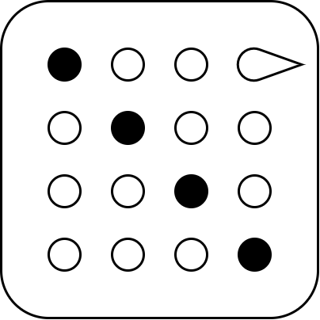

# Disfigure

**Disfigure.js** is a library for rigging boneless 3D models. It is highly
experimental, proof-of-concept, and very much work-in-progress.

**You've been warned.**

Under the skin it uses quaternions and bent 3D spaces, but you do not need to
know them. It is called *Disfigure* because the very first attempt at bending space 
turned the model into a horrifying mess of limbs. It still gives me nightmares.

* [**Disfigure.js** user guide](https://boytchev.github.io/disfigure/docs/userguide.html)
* [**Disfigure.js** API reference](https://boytchev.github.io/disfigure/docs/api.html)

 

Other examples from the user guide. Sorted by link length to increase your confusion.

 

Videos of earlier attempts at TSL rigging, used mainly as my do-not-give-up pills.

 

	<a href="docs/cookies.html">Cookies</a> &middot;
	<a href="docs/licence.html">Licence</a> &middot;
	<a href="https://github.com/boytchev/disfigure">GitHub</a> <!--&middot; 
	<a href="https://www.npmjs.com/package/disfigure">Legacy NPM</a> &middot; 
	<a href="https://boytchev.github.io/disfigure/legacy/index.html">Legacy version</a>
	-->

