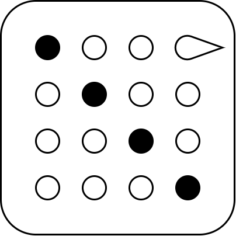

# Disfigure

A library to rig boneless and morphless 3D models. **WIP.**

* [**Disfigure** User guide](https://boytchev.github.io/disfigure/docs/userguide.html)
* [**Disfigure** Posture editor](https://boytchev.github.io/disfigure/poser)

## Social media

Videos of work-in-progress and earlier attempts at TSL rigging. Click on a snapshot
to go to an X post with a video and (sometimes) a link to live demo.

	<a href="docs/cookies.html">Cookies</a> &middot;
	<a href="docs/licence.html">Licence</a> &middot;
	<a href="https://github.com/boytchev/disfigure">GitHub</a>
	<a href="https://www.npmjs.com/package/disfigure">NPM</a>

